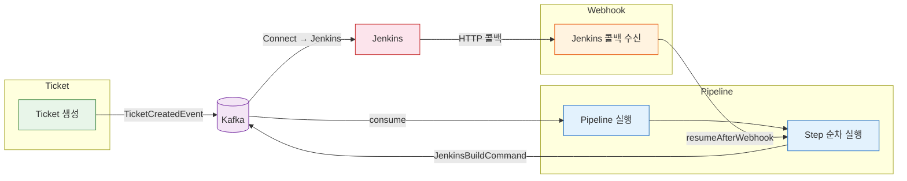

# 도메인 리뷰 가이드

이 문서는 redpanda-playground 프로젝트의 핵심 도메인 3개를 온보딩 관점에서 정리한다.
기존 `docs/guide/`나 `docs/patterns/`가 아키텍처와 패턴 중심이라면, 이 리뷰 문서는 **"이 도메인이 뭘 하는 건지"**를 빠르게 파악하는 데 초점을 맞춘다.

---

## 전체 흐름

세 도메인은 데이터가 흐르는 순서대로 연결된다. Ticket이 생성되면 Pipeline이 실행되고, 외부 시스템의 콜백은 Webhook을 통해 Pipeline에 전달된다.

---

## 읽기 순서

데이터 흐름을 따라 순서대로 읽으면 자연스럽게 전체 그림이 그려진다.

| 순서 | 문서 | 한 줄 소개 |
|:---:|------|-----------|
| 1 | [01-ticket.md](01-ticket.md) | 배포 대상을 정의하는 시작점. Ticket과 TicketSource(GIT/NEXUS/HARBOR)의 관계, 상태 전이, 이벤트 발행까지 다룬다. |
| 2 | [02-pipeline.md](02-pipeline.md) | Ticket을 실제로 배포하는 SAGA Orchestrator. Break-and-Resume 패턴으로 Jenkins 같은 비동기 외부 시스템과 협업하는 방법을 설명한다. |
| 3 | [03-webhook.md](03-webhook.md) | 외부 시스템의 완료 콜백을 수신해서 Pipeline에 전달하는 브릿지. Redpanda Connect가 HTTP와 Kafka를 연결하는 구조를 다룬다. |

---

## 관련 문서

도메인 리뷰를 읽은 뒤 더 깊이 알고 싶다면 아래 문서를 참조한다.

| 주제 | 문서 |
|------|------|
| 전체 아키텍처 | [backend-deep-dive.md](../guide/backend-deep-dive.md) |
| 202 Accepted 패턴 | [01-async-accepted.md](../patterns/01-async-accepted.md) |
| SAGA Orchestrator 패턴 | [02-saga-orchestrator.md](../patterns/02-saga-orchestrator.md) |
| Break-and-Resume 패턴 | [05-break-and-resume.md](../patterns/05-break-and-resume.md) |
| Redpanda Connect 브릿지 | [06-redpanda-connect.md](../patterns/06-redpanda-connect.md) |
| 인프라 개요 | [01-project-overview.md](../infra/01-project-overview.md) |
