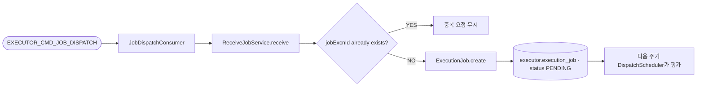

# Receive Job

## 목적

Operator가 발행한 `EXECUTOR_CMD_JOB_DISPATCH`를 받아 executor 내부 테이블 `execution_job`에 실행 대기 건을 생성한다.

이 유스케이스의 책임은 "받아 적재하는 것"까지다. 실제 디스패치 판단은 별도 유스케이스가 담당한다.

[HTML 시각화 보기](01-receive-job.html)

## 흐름도

## 진입점

- Kafka Consumer: `JobDispatchConsumer`
- Use case: `ReceiveJobUseCase`
- Application service: `ReceiveJobService`

## 입력

- `jobExcnId`
- `pipelineExcnId`
- `jobId`
- `priorityDt`
- `rgtrId`

메시지는 Avro `ExecutorJobDispatchCommand`로 들어오며, `priorityDt`는 문자열 timestamp에서 `LocalDateTime`으로 변환된다.

## 처리 흐름

1. `JobDispatchConsumer`가 `EXECUTOR_CMD_JOB_DISPATCH`를 consume한다.
2. 메시지 payload를 `ReceiveJobUseCase.receive(...)`로 전달한다.
3. `ReceiveJobService`는 먼저 `jobPort.existsById(jobExcnId)`로 중복 여부를 확인한다.
4. 이미 존재하면 중복 요청으로 보고 무시한다.
5. 없으면 `ExecutionJob.create(...)`로 도메인 객체를 생성한다.
6. 생성 시 기본값은 다음과 같다.
   - `status = PENDING`
   - `priority = 1`
   - `retryCnt = 0`
   - `logFileYn = N`
7. `jobPort.save(job)`로 저장한다.
8. 동시성 상황에서 중복 insert가 발생하면 `DataIntegrityViolationException`을 잡고 멱등하게 무시한다.

## 핵심 로직

### 1. 멱등성 보장

이 유스케이스는 같은 `jobExcnId`가 다시 와도 새 Job을 만들지 않는다.

- 1차 방어: `existsById`
- 2차 방어: 저장 중 unique 충돌을 잡아 무시

즉, at-least-once 메시지 소비 환경을 전제로 작성돼 있다.

### 2. 상태는 항상 `PENDING`에서 시작

수신 시점에는 Jenkins 슬롯 확인이나 Job 정의 조회를 하지 않는다.
우선 "실행 대기 레코드 생성"만 보장하고, 뒤 단계가 이를 소비한다.

이 분리 덕분에 메시지 수신 실패와 디스패치 실패를 따로 다룰 수 있다.

## 저장 결과

`execution_job`에 최소 다음 필드가 채워진다.

- `jobExcnId`
- `pipelineExcnId`
- `jobId`
- `status = PENDING`
- `priority = 1`
- `priorityDt`
- `retryCnt = 0`
- `logFileYn = N`
- `rgtrId`, `mdfrId`

## 실패 처리

- consumer 레벨 예외는 `@RetryableTopic`으로 재시도된다.
- 최종 소진 시 `DLT`로 빠지고 에러 로그를 남긴다.
- 하지만 DB 저장 중 중복은 실패가 아니라 정상 무시로 취급한다.

## 다음 단계와의 연결

이 유스케이스는 Job을 적재만 하고 끝난다.

실제 실행 후보 선정은 다음 경로에서 이어진다.

- 주기 스케줄러: `DispatchScheduler`
- use case: `EvaluateDispatchUseCase.tryDispatch()`

## 관련 클래스

- `execution/infrastructure/messaging/JobDispatchConsumer`
- `execution/application/ReceiveJobService`
- `execution/domain/model/ExecutionJob`
- `execution/domain/port/out/ExecutionJobPort`
