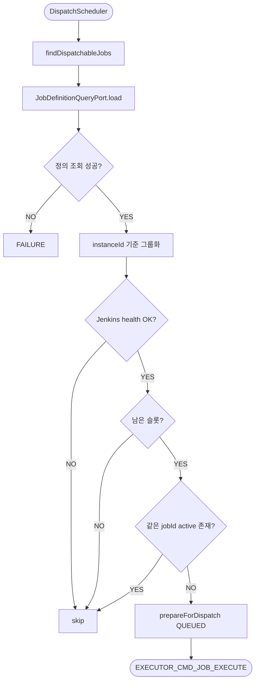
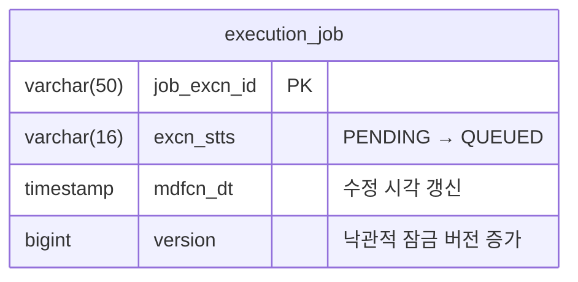
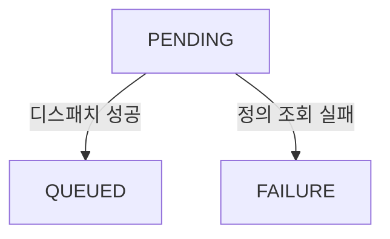

# Evaluate Dispatch
---
> `PENDING` 상태 Job 중 지금 실행 가능한 대상을 골라 `QUEUED`로 전환하고, 내부 실행 명령 `EXECUTOR_CMD_JOB_EXECUTE`를 발행한다. executor의 핵심 스케줄링 역할을 담당한다.

[HTML 시각화 보기](02-evaluate-dispatch.html)

## 흐름도



## 진입점

- Scheduler: `DispatchScheduler`
- Use case: `EvaluateDispatchUseCase`
- Application service: `DispatchEvaluatorService`

스케줄러는 3초 고정 지연으로 `tryDispatch()`를 호출한다:

```java
// DispatchScheduler.java
@Scheduled(
        fixedDelayString = "${executor.dispatch-interval-ms:3000}"
        , initialDelayString = "${executor.dispatch-initial-delay-ms:0}"
)
public void scheduledDispatch() {
    evaluateDispatchUseCase.tryDispatch();
}
```

`fixedDelay`는 이전 실행 완료 후 다음 실행까지의 간격이고, `initialDelay`는 앱 시작 후 첫 실행까지의 대기 시간이다. 기본값 0이므로 기동 즉시 밀린 PENDING Job을 처리한다.

## 처리 흐름

이 유스케이스는 2단계로 나뉜다. **Phase 1**에서 모든 Job의 정의를 조회하고 인스턴스별로 그룹화한 뒤, **Phase 2**에서 인스턴스 단위로 health check → 슬롯 계산 → 디스패치를 진행한다. health check와 슬롯 계산은 인스턴스당 1회만 수행하므로 Job 수에 비례해 Jenkins API 호출이 늘어나지 않는다.

### 2단계 구조 시각화

```
Phase 1: 정의 조회 + 인스턴스 그룹화
┌──────────────────────────────────────────────────────┐
│ PENDING Jobs (priority순 조회, FOR UPDATE SKIP LOCKED)│
│                                                      │
│  JEX-1 (jobId=A) ─── load ──→ instanceId=1          │
│  JEX-2 (jobId=B) ─── load ──→ instanceId=1          │
│  JEX-3 (jobId=C) ─── load ──→ instanceId=2          │
│  JEX-4 (jobId=D) ─── load ──✗ 정의 없음 → FAILURE    │
│                                                      │
│  결과: { 1: [JEX-1, JEX-2], 2: [JEX-3] }            │
└──────────────────────────────────────────────────────┘

Phase 2: 인스턴스 단위 디스패치 (인스턴스당 1회씩)
┌─────────────── instanceId=1 ─────────────────┐
│ ① isHealthy(1)          → 1회 호출           │
│ ② activeCount(1)        → QUEUED+SUBMITTED   │
│                           +RUNNING 합산      │
│ ③ isImmediatelyExecutable(1) → 3            │
│ ④ remainingSlots        → 3 - 1 = 2          │
│ ⑤ JEX-1: 중복체크 → QUEUED → publish         │
│ ⑥ JEX-2: 중복체크 → QUEUED → publish         │
└──────────────────────────────────────────────┘
┌─────────────── instanceId=2 ─────────────────┐
│ ① isHealthy(2)          → unhealthy → skip   │
│   (JEX-3은 PENDING 유지, 다음 주기에 재시도)    │
└──────────────────────────────────────────────┘
```

### Phase 1 — tryDispatch 전체 코드

```java
// DispatchEvaluatorService.java
@Transactional
public void tryDispatch() {
    List<ExecutionJob> pendingJobs = jobPort.findDispatchableJobs(
            properties.getMaxBatchSize());

    if (pendingJobs.isEmpty()) {
        return;
    }

    // Phase 1: 정의 조회 + 인스턴스별 그룹화
    Map<Long, List<ExecutionJob>> jobsByInstance = new LinkedHashMap<>();

    for (ExecutionJob job : pendingJobs) {
        var defInfoOpt = jobDefinitionQueryPort.load(job.getJobId());
        if (defInfoOpt.isEmpty()) {
            // 정의 조회 실패 = 데이터 누락이므로 재시도 없이 즉시 FAILURE
            job.transitionTo(ExecutionJobStatus.FAILURE);
            jobPort.save(job);
            continue;
        }
        jobsByInstance.computeIfAbsent(defInfoOpt.get().jenkinsInstanceId(), ignored -> new ArrayList<>())
                .add(job);
    }

    // Phase 2: 인스턴스 단위 디스패치
    for (var entry : jobsByInstance.entrySet()) {
        dispatchForInstance(entry.getKey(), entry.getValue());
    }
}
```

### Phase 2 — dispatchForInstance 전체 코드

```java
// DispatchEvaluatorService.java
private void dispatchForInstance(long instanceId, List<ExecutionJob> jobs) {
    // ① health check — 인스턴스당 1회
    if (!jenkinsQueryPort.isHealthy(instanceId)) {
        return;
    }

    // ② 슬롯 계산 — 인스턴스당 1회
    int activeCount = jobPort.countActiveJobsByJenkinsInstanceId(instanceId, ACTIVE_STATUSES);
    int dispatchCapacity = jenkinsQueryPort.isImmediatelyExecutable(instanceId);
    int remainingSlots = dispatchCapacity - activeCount;

    if (remainingSlots <= 0) {
        return;
    }

    // ③ 가용 슬롯 내에서 Job 디스패치
    for (ExecutionJob job : jobs) {
        if (remainingSlots <= 0) {
            break;
        }

        if (jobPort.existsByJobIdAndStatusIn(job.getJobId(), ACTIVE_STATUSES)) {
            continue;
        }

        dispatchService.prepareForDispatch(job);
        jobPort.save(job);
        publishPort.publishExecuteCommand(job);
        remainingSlots--;
    }
}
```

### 코드 설명

**Phase 1 — 정의 조회 + 그룹화**: 각 Job마다 `jobDefinitionQueryPort.load(jobId)`로 Jenkins 인스턴스를 찾는다. port는 `Optional`을 반환하므로, `empty`이면 데이터 누락으로 판단해 재시도 없이 즉시 `FAILURE`로 전환한다. 이 경로는 예외 처리(`try-catch`)가 아니라 `Optional.empty()` 체크로 처리한다. 정상 조회된 Job들은 `jenkinsInstanceId` 기준으로 `Map`에 그룹화한다.

**Phase 2 — 인스턴스 단위 디스패치**: 그룹화된 인스턴스별로 `dispatchForInstance`를 호출한다. health check와 슬롯 계산은 **인스턴스당 1회**만 수행하므로, Job이 10개여도 Jenkins API 호출은 인스턴스 수만큼만 발생한다.

### 슬롯 계산 내부 코드

**activeCount** — cross-schema 조인으로 특정 Jenkins 인스턴스에 연결된 active Job 수를 센다:

```sql
-- ExecutionJobJpaRepository (nativeQuery)
SELECT COUNT(*) FROM executor.execution_job ej
JOIN operator.job j ON j.job_id = ej.job_id
JOIN operator.purpose p ON p.id = CAST(j.preset_id AS BIGINT)
JOIN operator.purpose_entry pe ON pe.purpose_id = p.id AND pe.category = 'CI_CD_TOOL'
JOIN operator.support_tool st ON st.id = pe.tool_id
WHERE st.id = :jenkinsInstanceId AND ej.excn_stts IN :statuses
```

`execution_job` → `operator.job` → `purpose` → `purpose_entry` → `support_tool`로 4단 조인하여 해당 Jenkins 인스턴스에 연결된 Job만 필터한다. `statuses`는 `QUEUED`, `SUBMITTED`, `RUNNING` 세 가지이므로, 이미 큐에 들어간 Job이나 트리거됐지만 아직 시작되지 않은 Job도 슬롯을 점유하는 것으로 계산한다.

**isImmediatelyExecutable** — 실제 Jenkins를 조회해 디스패치 가능한 슬롯 수를 반환한다:

```java
// JenkinsClient.java
public int isImmediatelyExecutable(long jenkinsInstanceId) {
    if (!isHealthy(jenkinsInstanceId)) {
        return 0;
    }

    var info = toolInfoReader.get(jenkinsInstanceId);
    return remoteApiClient.queryDispatchCapacity(
            jenkinsInstanceId,
            URI.create(info.url()),
            buildAuthHeader(info),
            properties.getDynamicK8sDispatchCapacity()
    );
}
```

슬롯 계산에 필요한 조회는 파일을 분리했다.

```java
// JenkinsToolInfoReader.java
var sql = "SELECT url, username, api_token, health_status, health_checked_at "
        + "FROM operator.support_tool WHERE id = ?";
```

```java
// JenkinsRemoteApiClient.java
public int queryDispatchCapacity(long jenkinsInstanceId,
                                 URI baseUri,
                                 String auth,
                                 int dynamicK8sDispatchCapacity) {
    if (isK8sDynamic(jenkinsInstanceId, baseUri, auth)) {
        return dynamicK8sDispatchCapacity;
    }
    return getComputerSnapshot(baseUri, auth).totalExecutors();
}
```

정적 Jenkins는 `GET /computer/api/json`의 `totalExecutors`를 사용한다. 동적 Pod Jenkins는 `totalExecutors = 0`이거나 agent label에 `k8s`가 포함되면 감지하며, 이 경우 Jenkins 값 대신 애플리케이션 설정값 `executor.dynamic-k8s-dispatch-capacity`를 반환한다. `operator.support_tool`은 인증/health 정보만 읽고, Jenkins 런타임 API 조회는 별도 파일에서 처리한다.

**중복 체크 + QUEUED 전환**: 같은 `jobId`가 이미 active 상태에 있으면 중복 실행 방지를 위해 skip한다. 실행 가능한 Job은 `prepareForDispatch`(`transitionTo(QUEUED)`)로 전환 후 `publishExecuteCommand`로 내부 execute command를 발행한다. Jenkins API는 여기서 호출하지 않으며, 실제 호출은 03-execute-job에서 수행된다.

## 출력 메시지

성공적으로 선정된 Job마다 내부 Avro command가 발행된다:

```avro
// ExecutorJobExecuteCommand.avsc (Executor 내부)
{
  "name": "ExecutorJobExecuteCommand",
  "namespace": "com.study.playground.avro.executor",
  "fields": [
    {"name": "jobExcnId",       "type": "string"},
    {"name": "jobId",           "type": "string"},
    {"name": "idempotencyKey",  "type": "string"},
    {"name": "timestamp",       "type": "string", "doc": "ISO 8601"}
  ]
}
```

## 테이블 변경

이 유스케이스에서 변경되는 `execution_job` 필드는 다음과 같다.



정의 조회 실패 시에는 `excn_stts`가 `PENDING`(재시도) 유지 또는 `FAILURE`(포기)로 변경되고, `retry_cnt`가 증가한다.

## 핵심 로직

### 1. Jenkins health gate

디스패치 평가는 operator가 관리하는 health 상태를 먼저 본다. `health_status = HEALTHY`이고 `health_checked_at`가 설정값 이내여야 통과한다. Jenkins가 이미 unhealthy로 판단된 상태면 디스패치 스케줄러는 바로 skip한다.

### 2. 슬롯 계산 방식

health gate를 통과한 인스턴스에 대해서만 슬롯을 계산한다. `countActiveJobsByJenkinsInstanceId`로 executor DB에서 active Job 수를 세고, `isImmediatelyExecutable`가 반환한 슬롯 수를 차감한다. 이 값은 실제 Jenkins 조회 결과이며, K8S 동적 Pod Jenkins로 판단되면 애플리케이션 설정값을 사용한다.

### 3. Job 정의 조회 실패 처리

`jobId`에 대응하는 operator 스키마 데이터가 없으면 해당 Job은 바로 종료되지 않는다. 재시도 가능하면 `retryCnt`를 증가시키고 `PENDING` 상태를 유지하며, 재시도 한도를 넘기면 `FAILURE`로 전환한다.

### 4. 인스턴스 단위 배치

Job을 먼저 Jenkins 인스턴스별로 그룹화한 다음 처리한다. 이 구조 덕분에 인스턴스 A의 unhealthy 상태나 슬롯 부족이 인스턴스 B의 Job 처리에 영향을 주지 않는다.

## 동시성 제어

- DB 조회: `FOR UPDATE SKIP LOCKED`
- 상태 저장: JPA version 기반 낙관적 잠금
- 동일 `jobId` 활성 상태 중복 체크
- Jenkins health 상태는 operator 스케줄러가 별도로 갱신

## 상태 전이

이 유스케이스에서 발생하는 상태 전이는 3가지다.



| 조건 | 전이 | 트리거 코드 |
|------|------|------------|
| 디스패치 성공 | PENDING → QUEUED | `dispatchService.prepareForDispatch(job)` |
| 정의 조회 실패 | PENDING → FAILURE | `job.transitionTo(FAILURE)` |
| Jenkins unhealthy | 상태 변경 없음 | 다음 주기까지 PENDING 유지 |
| 슬롯 부족 | 상태 변경 없음 | 다음 주기까지 PENDING 유지 |
| 같은 jobId active 존재 | 상태 변경 없음 | 다음 주기까지 PENDING 유지 |

Jenkins unhealthy나 슬롯 부족은 Job 상태를 바꾸지 않는다. 해당 인스턴스의 Job은 다음 주기(3초 후)까지 `PENDING`으로 남는다.

## 관련 클래스

- `execution/infrastructure/scheduler/DispatchScheduler`
- `execution/application/DispatchEvaluatorService`
- `execution/infrastructure/persistence/ExecutionJobJpaRepository`
- `execution/infrastructure/persistence/JobDefinitionQueryAdapter`
- `execution/infrastructure/messaging/ExecuteCommandPublisher`
- `execution/domain/service/DispatchService`
