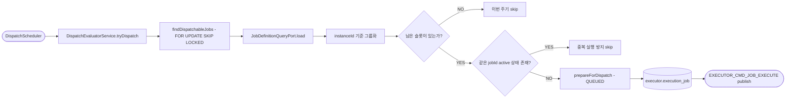

# Evaluate Dispatch

## 목적

`PENDING` 상태 Job 중 지금 실행 가능한 대상을 골라 `QUEUED`로 전환하고, 내부 실행 명령 `EXECUTOR_CMD_JOB_EXECUTE`를 발행한다.

이 유스케이스는 executor의 핵심 스케줄링 역할을 담당한다.

[HTML 시각화 보기](02-evaluate-dispatch.html)

## 흐름도

## 진입점

- Scheduler: `DispatchScheduler`
- Use case: `EvaluateDispatchUseCase`
- Application service: `DispatchEvaluatorService`

현재 live 코드는 이벤트 기반만이 아니라 3초 고정 지연 스케줄러로도 이 유스케이스를 호출한다.

## 처리 흐름

1. `DispatchScheduler`가 `tryDispatch()`를 주기적으로 호출한다.
2. `jobPort.findDispatchableJobs(maxBatchSize)`로 `PENDING` Job을 우선순위 순으로 조회한다.
3. 이 조회는 `FOR UPDATE SKIP LOCKED`를 사용하므로 멀티 인스턴스 환경에서 같은 Job을 동시에 집지 않는다.
4. 각 Job마다 `jobDefinitionQueryPort.load(jobId)`로 Jenkins 인스턴스와 Jenkins job path를 찾는다.
5. 조회된 Job들을 `jenkinsInstanceId` 기준으로 묶는다.
6. 인스턴스별로 다음을 수행한다.
   - Jenkins reachable 확인
   - 현재 active job 수 조회
   - `support_tool.max_executors` 조회
   - 남은 슬롯 수 계산
7. 슬롯이 남아 있으면 Job을 순서대로 순회한다.
8. 같은 `jobId`가 이미 `QUEUED`, `SUBMITTED`, `RUNNING`에 있으면 중복 실행을 막기 위해 skip한다.
9. 실행 가능한 Job은 `DispatchService.prepareForDispatch(job)`로 `QUEUED` 전환한다.
10. 저장 후 `PublishExecuteCommandPort.publishExecuteCommand(job)`를 호출한다.

## 핵심 로직

### 1. 조회 순서

대상 Job 조회는 다음 순서를 따른다.

- `priority ASC`
- `priorityDt ASC`

즉, 우선순위 숫자가 낮을수록 먼저, 같으면 기준 시각이 빠를수록 먼저 평가된다.

### 2. 슬롯 계산 방식

live 코드는 `JenkinsQueryPort.isImmediatelyExecutable()`를 쓰지 않고, 더 단순한 방식으로 슬롯을 계산한다.

- `countActiveJobsByJenkinsInstanceId(instanceId, ACTIVE_STATUSES)`
- `getMaxExecutors(instanceId)`
- `remainingSlots = maxExecutors - activeCount`

여기서 active status는 아래 세 가지다.

- `QUEUED`
- `SUBMITTED`
- `RUNNING`

즉, executor가 스스로 잡고 있는 활성 건 수와 DB의 인스턴스 설정값을 기준으로 슬롯을 계산한다.

### 3. Job 정의 조회 실패 처리

`jobId`에 대응하는 operator 스키마 데이터가 없으면 해당 Job은 바로 종료되지 않는다.

- 재시도 가능하면 `retryCnt` 증가 후 `PENDING` 유지
- 재시도 한도를 넘기면 `FAILURE` 전환

즉, cross-schema lookup 실패를 일시 장애로 보고 복구 기회를 준다.

### 4. 인스턴스 단위 배치

Job을 먼저 Jenkins 인스턴스별로 그룹화한 다음 처리한다.
이 구조 덕분에 인스턴스 A의 슬롯 부족이 인스턴스 B의 Job 처리에 영향을 덜 준다.

## 상태 변화

- 입력 상태: `PENDING`
- 성공 시: `QUEUED`
- 정의 조회 실패 후 재시도 가능: `PENDING`
- 정의 조회 실패 후 재시도 불가: `FAILURE`

## 출력

성공적으로 선정된 Job마다 Outbox를 통해 `EXECUTOR_CMD_JOB_EXECUTE` 이벤트가 발행된다.

이 시점에는 Jenkins API를 아직 호출하지 않는다.
실제 호출은 다음 유스케이스에서 수행된다.

## 동시성 제어

- DB 조회: `FOR UPDATE SKIP LOCKED`
- 상태 저장: JPA version 기반 낙관적 잠금
- 동일 `jobId` 활성 상태 중복 체크

이 세 가지가 합쳐져 중복 디스패치를 줄인다.

## 관련 클래스

- `execution/infrastructure/scheduler/DispatchScheduler`
- `execution/application/DispatchEvaluatorService`
- `execution/infrastructure/persistence/ExecutionJobJpaRepository`
- `execution/infrastructure/persistence/JobDefinitionQueryAdapter`
- `execution/infrastructure/messaging/ExecuteCommandPublisher`
