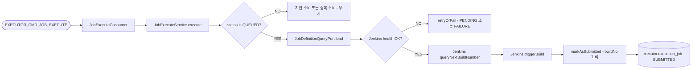

# Execute Job

## 목적

`QUEUED` 상태 Job을 Jenkins에 실제로 트리거하고, 빌드 번호를 확보한 뒤 `SUBMITTED` 상태로 전환한다.

이 유스케이스는 "실행 후보 선정"과 "실제 Jenkins 호출"을 분리하는 역할을 한다.

[HTML 시각화 보기](03-execute-job.html)

## 흐름도

## 진입점

- Kafka Consumer: `JobExecuteConsumer`
- Use case: `ExecuteJobUseCase`
- Application service: `JobExecuteService`

## 입력

- `jobExcnId`

입력 메시지는 내부 outbox publish 결과인 `ExecutorJobExecuteCommand`이다.

## 처리 흐름

1. `JobExecuteConsumer`가 `EXECUTOR_CMD_JOB_EXECUTE`를 consume한다.
2. `JobExecuteService.execute(jobExcnId)`를 호출한다.
3. `jobPort.findById(jobExcnId)`로 Job을 조회한다.
4. 상태가 `QUEUED`가 아니면 중복 소비나 지연 소비로 판단하고 무시한다.
5. `jobDefinitionQueryPort.load(jobId)`로 Jenkins 인스턴스와 job path를 구한다.
6. `jenkinsQueryPort.isHealthy(instanceId)`로 operator가 기록한 Jenkins health 상태를 확인한다.
7. unhealthy면 즉시 Jenkins 호출을 하지 않고 `retryOrFail`로 `PENDING` 복귀 또는 `FAILURE` 전환한다.
8. healthy면 `jenkinsQueryPort.queryNextBuildNumber(...)`로 Jenkins의 다음 빌드 번호를 먼저 읽는다.
9. `jenkinsTriggerPort.triggerBuild(...)`로 `buildWithParameters`를 호출한다.
10. 성공 시 `DispatchService.markAsSubmitted(job, nextBuildNo)`를 호출한다.
11. 저장 후 로그를 남긴다.

## 핵심 로직

### 1. 빌드 번호를 먼저 확보

Jenkins가 trigger 응답으로 build number를 직접 반환하지 않기 때문에,
현재 구현은 trigger 전에 `nextBuildNumber`를 읽고 그 값을 예약 번호처럼 사용한다.

즉, 흐름은 다음과 같다.

1. `GET job api`로 `nextBuildNumber` 조회
2. `POST buildWithParameters` 호출
3. 로컬 DB에 그 번호를 기록

이 번호는 이후 Jenkins 시작/완료 콜백과 매칭하는 핵심 키가 된다.

### 2. health gate

실행 단계에서는 Jenkins live ping을 하지 않는다.
operator가 1분 주기로 갱신한 health 결과를 사용한다.

- `health_status = HEALTHY`
- `health_checked_at`가 최근 설정값 이내

이 조건을 만족하지 않으면 실행을 강행하지 않고 재시도로 되돌린다.

### 3. 인증 방식

runtime Jenkins 호출은 전부 API token 기반 Basic Auth다.

- 조회 소스: `operator.support_tool.api_token`
- 인증 헤더: `Authorization: Basic base64(username:apiToken)`
- `crumbIssuer` 호출: 없음
- `Jenkins-Crumb` 헤더: 없음

Jenkins의 crumb은 operator의 `JenkinsTokenService`가 API token을 발급할 때만 일시적으로 사용한다.
executor는 crumb을 저장하거나 조회하지 않는다.

### 4. 실패 시 재시도

Jenkins 조회나 트리거 중 예외가 나면 `DispatchService.retryOrFail(job, maxRetries)`가 호출된다.

- 재시도 가능: `retryCnt` 증가 후 `PENDING` 복귀
- 재시도 불가: `FAILURE`

`PENDING`으로 복귀한 Job은 다시 `Evaluate Dispatch` 대상이 된다.

## 상태 변화

- 입력 상태: `QUEUED`
- 성공: `SUBMITTED`
- unhealthy 또는 실패 후 재시도 가능: `PENDING`
- 실패 후 재시도 불가: `FAILURE`

## 외부 연동

### Jenkins 조회

- `queryNextBuildNumber(instanceId, jenkinsJobPath)`

### Jenkins 실행

- `triggerBuild(instanceId, jenkinsJobPath, jobId)`

내부적으로는 다음이 수행된다.

- Jenkins URL, 계정, `api_token`을 `operator.support_tool`에서 조회
- API token 기반 Basic Auth 헤더 구성
- `buildWithParameters` POST 호출

## 다음 단계와의 연결

Jenkins가 실제로 빌드를 시작하면 별도 webhook listener가 Kafka에 시작 이벤트를 발행한다.
그 다음 유스케이스가 `SUBMITTED -> RUNNING`을 처리한다.

## 관련 클래스

- `execution/infrastructure/messaging/JobExecuteConsumer`
- `execution/application/JobExecuteService`
- `execution/infrastructure/jenkins/JenkinsClient`
- `execution/domain/service/DispatchService`
