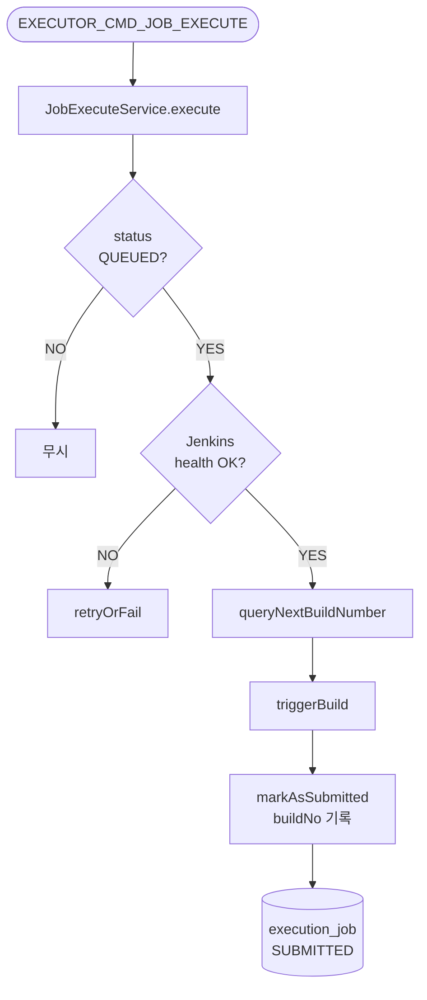
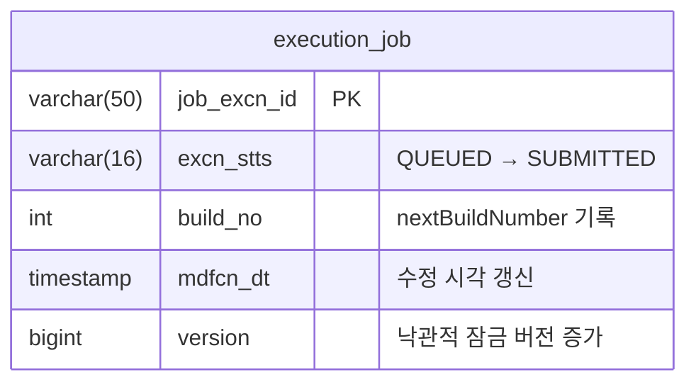

# Execute Job
---
> `QUEUED` 상태 Job을 Jenkins에 실제로 트리거하고, 빌드 번호를 확보한 뒤 `SUBMITTED` 상태로 전환한다. "실행 후보 선정"과 "실제 Jenkins 호출"을 분리하는 역할을 한다.

[HTML 시각화 보기](03-execute-job.html)

## 흐름도



## 진입점

- Kafka Consumer: `JobExecuteConsumer`
- Use case: `ExecuteJobUseCase`
- Application service: `JobExecuteService`

## 입력

입력 메시지는 02-evaluate-dispatch에서 발행한 내부 Avro command다.

```avro
// ExecutorJobExecuteCommand.avsc (Executor 내부)
{
  "name": "ExecutorJobExecuteCommand",
  "namespace": "com.study.playground.avro.executor",
  "fields": [
    {"name": "jobExcnId",       "type": "string"},
    {"name": "jobId",           "type": "string"},
    {"name": "idempotencyKey",  "type": "string"},
    {"name": "timestamp",       "type": "string", "doc": "ISO 8601"}
  ]
}
```

## 처리 흐름

### use case 전체 코드

```java
// JobExecuteService.java
@Transactional
public void execute(String jobExcnId) {
    ExecutionJob job = jobPort.findById(jobExcnId)
            .orElseThrow(() -> new IllegalStateException("Unknown jobExcnId=" + jobExcnId));

    if (job.getStatus() != ExecutionJobStatus.QUEUED) {
        log.debug("[JobExecute] Not QUEUED: jobExcnId={}, status={}"
                , jobExcnId, job.getStatus());
        return;
    }

    try {
        var defInfo = jobDefinitionQueryPort.load(job.getJobId());
        long jenkinsInstanceId = defInfo.jenkinsInstanceId();
        var jenkinsJobPath = defInfo.jenkinsJobPath();

        if (!jenkinsQueryPort.isHealthy(jenkinsInstanceId)) {
            dispatchService.retryOrFail(job, properties.getJobMaxRetries());
            jobPort.save(job);
            return;
        }

        int nextBuildNo = jenkinsQueryPort.queryNextBuildNumber(jenkinsInstanceId, jenkinsJobPath);
        jenkinsTriggerPort.triggerBuild(jenkinsInstanceId, jenkinsJobPath, job.getJobId());

        // nextBuildNumber를 먼저 읽어 둬야 started/completed webhook과 동일 buildNo로 매칭할 수 있다.
        dispatchService.markAsSubmitted(job, nextBuildNo);
        jobPort.save(job);
    } catch (Exception e) {
        log.error("[JobExecute] Failed: jobExcnId={}, error={}", jobExcnId, e.getMessage());
        boolean retried = dispatchService.retryOrFail(job, properties.getJobMaxRetries());
        jobPort.save(job);
    }
}
```

### 코드 설명

**QUEUED 가드**: 상태가 `QUEUED`가 아니면 중복 소비나 지연 소비로 판단하고 무시한다. stale recovery가 먼저 `PENDING`으로 되돌린 경우 뒤늦게 도착한 execute command는 여기서 걸러진다.

**health gate**: operator가 주기적으로 갱신한 health 결과(`operator.support_tool.health_status`, `health_checked_at`)를 사용한다. Jenkins live ping을 하지 않는다. unhealthy면 `retryOrFail`로 되돌린다.

**빌드 번호 선확보**: Jenkins가 trigger 응답으로 build number를 직접 반환하지 않기 때문에, `queryNextBuildNumber`를 먼저 읽고 `triggerBuild`를 호출한다. 이 번호가 이후 시작/완료 콜백 매칭의 핵심 키다. `markAsSubmitted`는 내부에서 `recordBuildNo` + `transitionTo(SUBMITTED)`를 호출한다.

**예외 시 retryOrFail**: Jenkins 조회나 트리거 중 예외가 나면 `retryOrFail`이 호출된다. 재시도 가능하면 `retryCnt` 증가 후 `PENDING` 복귀(다시 02-evaluate-dispatch 대상), 한도 초과 시 `FAILURE` 전환이다.

## 테이블 변경

이 유스케이스에서 변경되는 `execution_job` 필드는 다음과 같다.



실패 시에는 `excn_stts`가 `PENDING`(재시도) 또는 `FAILURE`(포기)로 변경되고, `retry_cnt`가 증가한다.

## 핵심 로직

### 1. 빌드 번호를 먼저 확보

Jenkins trigger 응답에는 build number가 없다. `GET job api`로 `nextBuildNumber`를 조회한 뒤 `POST buildWithParameters`를 호출하고, 조회한 번호를 로컬 DB에 기록한다. 이 번호가 이후 Jenkins 시작/완료 콜백과 매칭하는 핵심 키다.

### 2. health gate

operator가 주기적으로 갱신한 `health_status = HEALTHY`와 `health_checked_at`이 최근 설정값 이내인지 확인한다. Jenkins가 이미 unhealthy로 판단된 상태면 API 호출 없이 `retryOrFail`로 되돌린다.

### 3. 인증 방식

runtime Jenkins 호출은 전부 API token 기반 Basic Auth다. 조회 소스는 `operator.support_tool.api_token`이며, `crumbIssuer` 호출은 하지 않는다. crumb은 operator의 `JenkinsTokenService`가 API token을 발급할 때만 일시적으로 사용한다.

## 상태 변화

- 입력 상태: `QUEUED`
- 성공: `SUBMITTED`
- unhealthy 또는 실패 후 재시도 가능: `PENDING`
- 실패 후 재시도 불가: `FAILURE`

## 관련 클래스

- `execution/infrastructure/messaging/JobExecuteConsumer`
- `execution/application/JobExecuteService`
- `execution/infrastructure/jenkins/JenkinsClient`
- `execution/domain/service/DispatchService`
- `execution/domain/port/out/JenkinsTriggerPort`
- `execution/domain/port/out/JenkinsQueryPort`
