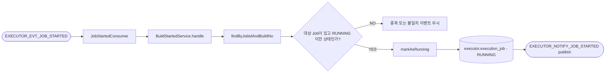

# Handle Build Started

## 목적

Jenkins가 실제로 빌드를 시작했다는 이벤트를 받아 executor 내부 상태를 `RUNNING`으로 전환하고, operator에 시작 사실을 통지한다.

이 유스케이스는 "Jenkins 큐에 들어감"과 "실행이 실제 시작됨"을 구분하기 위해 존재한다.

[HTML 시각화 보기](04-handle-build-started.html)

## 흐름도

## 진입점

- Kafka Consumer: `JobStartedConsumer`
- Use case: `HandleBuildStartedUseCase`
- Application service: `BuildStartedService`

## 입력

JSON 기반 콜백 이벤트에서 다음 값을 읽는다.

- `jobId`
- `buildNumber`

이 둘을 합쳐 executor의 `ExecutionJob`을 찾는다.

## 처리 흐름

1. `JobStartedConsumer`가 `EXECUTOR_EVT_JOB_STARTED`를 consume한다.
2. JSON payload를 `BuildCallback.started(jobId, buildNumber)`로 변환한다.
3. `BuildStartedService.handle(callback)`를 호출한다.
4. `jobPort.findByJobIdAndBuildNo(jobId, buildNumber)`로 대상 Job을 찾는다.
5. 못 찾으면 경고 로그만 남기고 종료한다.
6. 이미 터미널 상태면 중복 완료 이후 도착한 시작 이벤트로 보고 무시한다.
7. 이미 `RUNNING`이면 중복 시작 이벤트로 보고 무시한다.
8. 정상 케이스면 `DispatchService.markAsRunning(job, buildNo)`를 호출한다.
9. 저장 후 `NotifyJobStartedPort.notify(...)`로 operator에 시작 이벤트를 보낸다.

## 핵심 로직

### 1. 콜백 매칭 키는 `jobId + buildNumber`

executor는 Jenkins 시작 콜백에서 `jobExcnId`를 직접 받지 않아도 매칭할 수 있도록,
앞 단계에서 `buildNo`를 미리 저장해 둔다.

따라서 이 유스케이스는 다음 전제를 사용한다.

- 같은 `jobId`
- 같은 `buildNumber`

이 둘이 같으면 동일 실행 건으로 본다.

### 2. 중복 이벤트 내성

시작 이벤트는 네트워크나 Jenkins 스크립트 특성상 중복 수신될 수 있다.
그래서 아래 조건에서는 실패로 보지 않고 조용히 무시한다.

- 대상 Job 없음
- 이미 터미널
- 이미 `RUNNING`

즉, 이 유스케이스는 idempotent 하게 설계돼 있다.

### 3. operator 상태 갱신은 직접 DB 수정이 아니라 notify

현재 live 코드는 operator DB를 cross-schema update 하지 않는다.
대신 executor가 started notify 이벤트를 발행하고, operator가 자기 DB를 갱신하는 구조다.

즉, 책임은 이렇게 나뉜다.

- executor: 실행 상태 사실 생성
- operator: 자기 스키마 상태 반영

## 상태 변화

- 입력 상태: 주로 `SUBMITTED`
- 성공 시: `RUNNING`

`ExecutionJob.transitionTo()`가 호출되면서 `bgngDt`도 같이 기록된다.

## 출력

Outbox를 통해 `EXECUTOR_NOTIFY_JOB_STARTED` 이벤트가 발행된다.

포함 정보:

- `jobExcnId`
- `pipelineExcnId`
- `jobId`
- `buildNo`

## 관련 클래스

- `execution/infrastructure/messaging/JobStartedConsumer`
- `execution/application/BuildStartedService`
- `execution/infrastructure/messaging/JobStartedNotifyPublisher`
- `execution/domain/model/BuildCallback`
