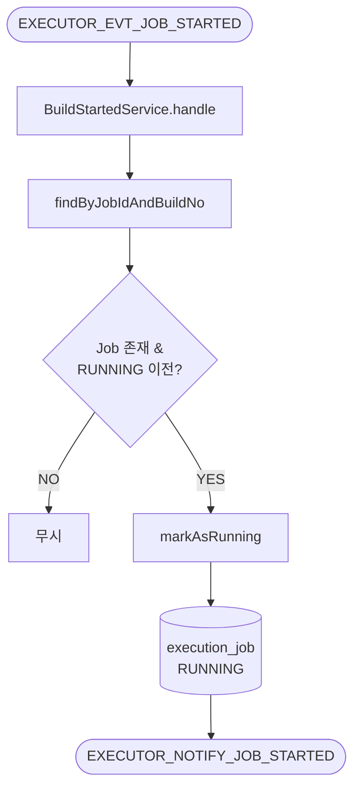
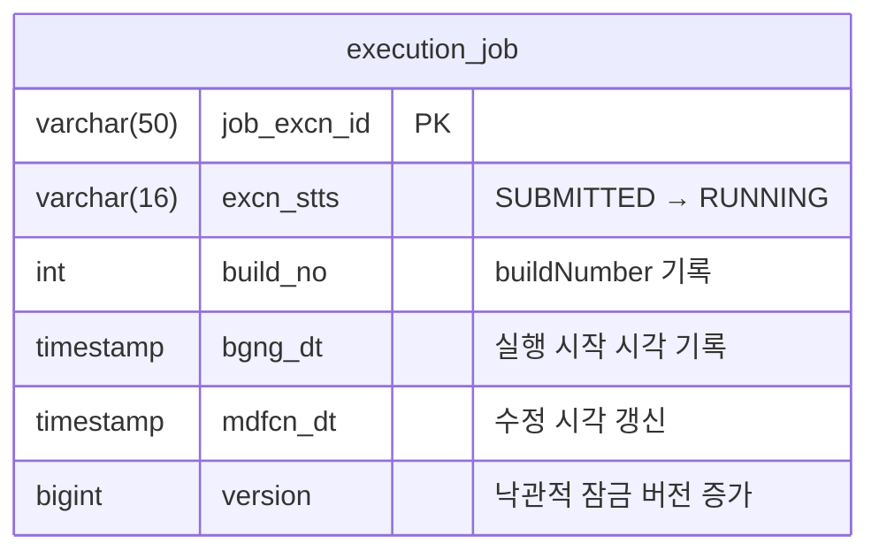

# Handle Build Started
---
> Jenkins가 실제로 빌드를 시작했다는 이벤트를 받아 executor 내부 상태를 `RUNNING`으로 전환하고, operator에 시작 사실을 통지한다. "Jenkins 큐에 들어감"과 "실행이 실제 시작됨"을 구분하기 위해 존재한다.

[HTML 시각화 보기](04-handle-build-started.html)

## 흐름도



## 진입점

- Kafka Consumer: `JobStartedConsumer`
- Use case: `HandleBuildStartedUseCase`
- Application service: `BuildStartedService`

## 입력

Jenkins `webhook-listener.groovy`가 `rpk produce`로 발행하는 JSON 이벤트다. Avro가 아닌 raw JSON이므로 consumer에서 직접 파싱한다.

```json
// EXECUTOR_EVT_JOB_STARTED (Jenkins → Executor, JSON)
{
  "jobId": "string",
  "buildNumber": 0
}
```

이 두 값을 합쳐 executor의 `ExecutionJob`을 찾는다.

## 처리 흐름

### consumer 진입

Jenkins 시작 이벤트는 Avro가 아닌 raw byte JSON으로 들어온다. consumer에서 `BuildCallback.started()`로 변환한다.

```java
// JobStartedConsumer.java
@KafkaListener(
        topics = Topics.EXECUTOR_EVT_JOB_STARTED
        , groupId = "${spring.kafka.consumer.group-id:executor-group}"
)
public void onJobStarted(ConsumerRecord<String, byte[]> record) {
    JsonNode json = objectMapper.readTree(record.value());
    var callback = BuildCallback.started(
            json.get("jobId").asText()
            , json.get("buildNumber").asInt()
    );
    handleStartedUseCase.handle(callback);
}
```

### use case 전체 코드

```java
// BuildStartedService.java
@Transactional
public void handle(BuildCallback callback) {
    ExecutionJob job = jobPort.findByJobIdAndBuildNo(
            callback.jobId(), callback.buildNumber()
    ).orElse(null);

    if (job == null) {
        log.warn("[BuildStarted] No matching job: jobId={}, buildNumber={}"
                , callback.jobId(), callback.buildNumber());
        return;
    }

    if (job.getStatus().isTerminal()) {
        log.debug("[BuildStarted] Already terminal: jobExcnId={}", job.getJobExcnId());
        return;
    }

    if (job.getStatus() == ExecutionJobStatus.RUNNING) {
        log.debug("[BuildStarted] Already RUNNING: jobExcnId={}", job.getJobExcnId());
        return;
    }

    // 1. executor DB 상태 전이
    dispatchService.markAsRunning(job, callback.buildNumber());
    jobPort.save(job);

    // 2. op에 시작 토픽 발행 (op가 자체 DB 갱신)
    notifyStartedPort.notify(
            job.getJobExcnId()
            , job.getPipelineExcnId()
            , job.getJobId()
            , callback.buildNumber()
    );
}
```

### 코드 설명

**콜백 매칭**: `jobId + buildNumber`가 매칭 키다. executor는 앞 단계(03-execute-job)에서 `buildNo`를 미리 저장해 두므로 `jobExcnId`를 직접 받지 않아도 매칭할 수 있다.

**중복·터미널 가드**: 시작 이벤트는 네트워크나 Jenkins 스크립트 특성상 중복 수신될 수 있다. Job 없음, 이미 터미널, 이미 RUNNING 세 경우 모두 실패가 아닌 정상 무시로 처리한다(idempotent).

**RUNNING 전이 + notify**: `markAsRunning`은 `recordBuildNo` + `transitionTo(RUNNING)`을 호출하며, `transitionTo(RUNNING)` 시 `bgngDt`도 같이 기록된다. operator에는 cross-schema update 대신 `EXECUTOR_NOTIFY_JOB_STARTED` 이벤트를 발행하고, operator가 자기 DB를 갱신하는 구조다.

## 출력 메시지

operator에 보내는 Avro 이벤트는 다음과 같다.

```avro
// ExecutorJobStartedEvent.avsc (Executor → Operator, Avro)
{
  "name": "ExecutorJobStartedEvent",
  "namespace": "com.study.playground.avro.executor",
  "fields": [
    {"name": "jobExcnId",       "type": "string"},
    {"name": "pipelineExcnId",  "type": ["null", "string"], "default": null},
    {"name": "jobId",           "type": "string"},
    {"name": "buildNo",         "type": "int"},
    {"name": "idempotencyKey",  "type": "string"},
    {"name": "timestamp",       "type": "string", "doc": "ISO 8601"}
  ]
}
```

## 테이블 변경

이 유스케이스에서 변경되는 `execution_job` 필드는 다음과 같다.



## 핵심 로직

### 1. 콜백 매칭 키는 jobId + buildNumber

executor는 Jenkins 시작 콜백에서 `jobExcnId`를 직접 받지 않아도 매칭할 수 있도록, 앞 단계에서 `buildNo`를 미리 저장해 둔다. 같은 `jobId`와 같은 `buildNumber`를 가진 레코드를 동일 실행 건으로 본다.

### 2. 중복 이벤트 내성

시작 이벤트는 네트워크나 Jenkins 스크립트 특성상 중복 수신될 수 있다. 대상 Job 없음, 이미 터미널 상태, 이미 `RUNNING`인 경우 모두 실패가 아닌 정상 무시로 처리한다. 즉, 이 유스케이스는 idempotent하게 설계돼 있다.

### 3. operator 상태 갱신은 notify 방식

현재 live 코드는 operator DB를 cross-schema update 하지 않는다. executor가 started notify 이벤트를 발행하고, operator가 자기 DB를 갱신하는 구조다.

- executor: 실행 상태 사실 생성
- operator: 자기 스키마 상태 반영

## 상태 변화

- 입력 상태: 주로 `SUBMITTED`
- 성공 시: `RUNNING`

## 관련 클래스

- `execution/infrastructure/messaging/JobStartedConsumer`
- `execution/application/BuildStartedService`
- `execution/infrastructure/messaging/JobStartedNotifyPublisher`
- `execution/domain/model/BuildCallback`
- `execution/domain/service/DispatchService`
