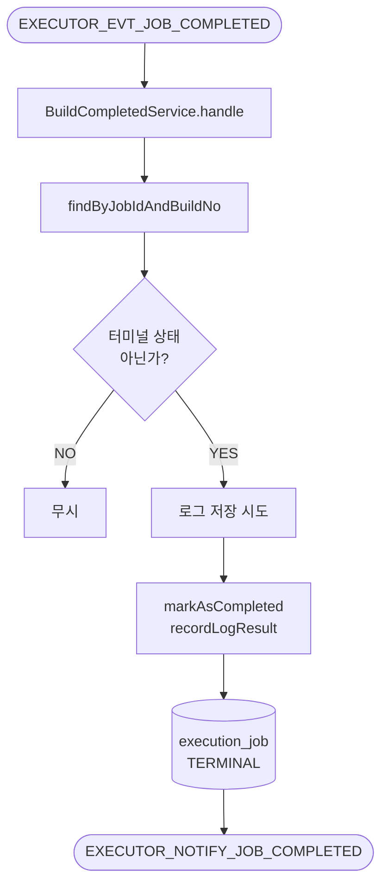
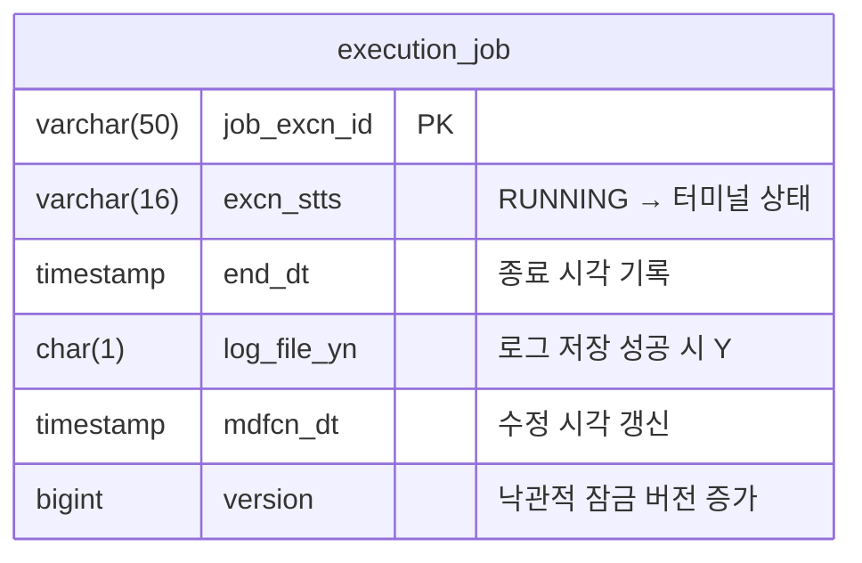

# Handle Build Completed
---
> Jenkins 종료 이벤트를 받아 executor Job을 터미널 상태로 전환하고, 로그 파일 저장 결과를 반영한 뒤 operator에 완료 사실을 통지한다. executor에서 가장 많은 후처리를 수행하는 유스케이스다.

[HTML 시각화 보기](05-handle-build-completed.html)

## 흐름도



## 진입점

- Kafka Consumer: `JobCompletedConsumer`
- Use case: `HandleBuildCompletedUseCase`
- Application service: `BuildCompletedService`

## 입력

Jenkins `webhook-listener.groovy`가 `rpk produce`로 발행하는 JSON 이벤트다. 시작 이벤트와 달리 `result`와 `logContent`가 추가된다.

```json
// EXECUTOR_EVT_JOB_COMPLETED (Jenkins → Executor, JSON)
{
  "jobId": "string",
  "buildNumber": 0,
  "result": "SUCCESS | FAILURE | UNSTABLE | ABORTED | NOT_BUILT",
  "logContent": "string (nullable)"
}
```

consumer에서 JSON을 파싱해 `BuildCallback`으로 변환한다:

```java
// JobCompletedConsumer.java
@KafkaListener(
        topics = Topics.EXECUTOR_EVT_JOB_COMPLETED
        , groupId = "${spring.kafka.consumer.group-id:executor-group}"
)
public void onJobCompleted(ConsumerRecord<String, byte[]> record) {
    JsonNode json = objectMapper.readTree(record.value());
    var callback = BuildCallback.completed(
            json.get("jobId").asText()
            , json.get("buildNumber").asInt()
            , json.has("result") ? json.get("result").asText() : null
            , json.has("logContent") ? json.get("logContent").asText() : null
    );
    handleCompletedUseCase.handle(callback);
}
```

## 처리 흐름

### consumer 진입

Jenkins 완료 이벤트는 시작 이벤트와 동일하게 raw JSON으로 들어온다. `result`와 `logContent`가 추가된다.

```java
// JobCompletedConsumer.java
@KafkaListener(
        topics = Topics.EXECUTOR_EVT_JOB_COMPLETED
        , groupId = "${spring.kafka.consumer.group-id:executor-group}"
)
public void onJobCompleted(ConsumerRecord<String, byte[]> record) {
    JsonNode json = objectMapper.readTree(record.value());
    var callback = BuildCallback.completed(
            json.get("jobId").asText()
            , json.get("buildNumber").asInt()
            , json.has("result") ? json.get("result").asText() : null
            , json.has("logContent") ? json.get("logContent").asText() : null
    );
    handleCompletedUseCase.handle(callback);
}
```

### use case 전체 코드

```java
// BuildCompletedService.java
@Transactional
public void handle(BuildCallback callback) {
    ExecutionJob job = jobPort.findByJobIdAndBuildNo(
            callback.jobId(), callback.buildNumber())
            .orElse(null);

    if (job == null) {
        log.warn("[BuildCompleted] No matching job: jobId={}, buildNumber={}"
                , callback.jobId(), callback.buildNumber());
        return;
    }

    if (job.getStatus().isTerminal()) {
        log.debug("[BuildCompleted] Already terminal: jobExcnId={}", job.getJobExcnId());
        return;
    }

    // 1. 로그 파일 적재 (실패 허용)
    String logFilePath = null;
    boolean logSaved = false;
    if (callback.logContent() != null && !callback.logContent().isBlank()) {
        var defInfo = jobDefinitionQueryPort.load(job.getJobId());
        var dirPath = defInfo.jenkinsJobPath();
        logSaved = logPort.save(dirPath, job.getJobExcnId(), callback.logContent());
        if (logSaved) {
            logFilePath = dirPath + "/" + job.getJobExcnId() + "_0";
        }
    }

    // 2. executor DB 상태 전이
    dispatchService.markAsCompleted(job, callback.result());
    dispatchService.recordLogResult(job, logSaved);
    jobPort.save(job);

    // 3. op에 완료 토픽 발행 (op가 자체 DB 갱신)
    var newStatus = ExecutionJobStatus.fromJenkinsResult(callback.result());
    boolean success = newStatus == ExecutionJobStatus.SUCCESS;
    notifyPort.notify(
            job.getJobExcnId()
            , job.getPipelineExcnId()
            , success
            , callback.result()
            , logFilePath
            , logSaved ? "Y" : "N"
            , success ? null : callback.result()
    );
}
```

### 코드 설명

**콜백 매칭 + 터미널 가드**: 04-handle-build-started와 동일하게 `jobId + buildNumber`로 매칭한다. 이미 터미널 상태면 중복 완료 이벤트로 보고 무시한다(idempotent).

**로그 저장 (실패 허용)**: 이 유스케이스의 1순위는 "실행 결과 반영"이고, 로그 적재는 부가 기능이다. `logPort.save()`는 파일시스템에 `{logPath}/{dirPath}/{jobExcnId}_0` 경로로 저장하며, 실패해도 예외를 던지지 않고 `false`를 반환한다. 로그 저장 실패가 Job 완료 자체를 막지 않는다.

**Jenkins result → executor status 매핑**: `markAsCompleted` 내부에서 `fromJenkinsResult()`가 호출된다. `SUCCESS`, `FAILURE`, `UNSTABLE`, `ABORTED`, `NOT_BUILT`, `NOT_EXECUTED` 6가지와 알 수 없는 값(→ `FAILURE`)을 매핑한다.

**completed notify**: operator에는 실행 결과, 로그 경로, 에러 메시지가 포함된 Avro 이벤트를 발행한다. 실패 케이스에서 `errorMessage`는 Jenkins result 문자열을 그대로 사용한다.

## 출력 메시지

```avro
// ExecutorJobCompletedEvent.avsc (Executor → Operator, Avro)
{
  "name": "ExecutorJobCompletedEvent",
  "namespace": "com.study.playground.avro.executor",
  "fields": [
    {"name": "jobExcnId",       "type": "string"},
    {"name": "pipelineExcnId",  "type": ["null", "string"], "default": null},
    {"name": "success",         "type": "boolean"},
    {"name": "result",          "type": "string"},
    {"name": "logFilePath",     "type": ["null", "string"], "default": null},
    {"name": "logFileYn",       "type": "string"},
    {"name": "errorMessage",    "type": ["null", "string"], "default": null},
    {"name": "idempotencyKey",  "type": "string"},
    {"name": "timestamp",       "type": "string", "doc": "ISO 8601"}
  ]
}
```

## 테이블 변경

이 유스케이스에서 변경되는 `execution_job` 필드는 다음과 같다.



## 핵심 로직

### 1. 로그 저장 실패는 전체 실패로 보지 않음

로그 저장은 시도하되, 실패해도 완료 상태 전이는 계속 진행한다. `logFileYn`과 notify payload에 저장 성공 여부를 남겨 operator가 로그 누락을 인지할 수 있게 한다.

### 2. Jenkins result → executor status 매핑

`fromJenkinsResult()`가 Jenkins 문자열을 executor enum으로 1:1 매핑한다. `SUCCESS`, `FAILURE`, `UNSTABLE`, `ABORTED`, `NOT_BUILT`, `NOT_EXECUTED` 6가지와 알 수 없는 값(→ `FAILURE`)을 처리한다.

### 3. 복구와의 관계

정상 경로에서는 이 유스케이스가 종료를 반영한다. 하지만 완료 webhook이 유실되면 `StaleJobRecoveryService`가 Jenkins API를 직접 조회해 같은 결과를 반영한다. 이 유스케이스는 정상 경로이고, 06-stale-job-recovery는 방어 경로다.

## 상태 변화

- 입력 상태: 주로 `RUNNING`, 경우에 따라 `SUBMITTED`
- 성공 시: Jenkins result에 해당하는 터미널 상태

터미널 상태 전이 시 `endDt`가 자동으로 기록된다.

## 관련 클래스

- `execution/infrastructure/messaging/JobCompletedConsumer`
- `execution/application/BuildCompletedService`
- `execution/infrastructure/filesystem/BuildLogFileWriter`
- `execution/infrastructure/messaging/JobCompletedNotifyPublisher`
- `execution/domain/model/ExecutionJobStatus`
- `execution/domain/service/DispatchService`
