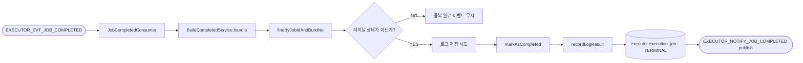

# Handle Build Completed

## 목적

Jenkins 종료 이벤트를 받아 executor Job을 터미널 상태로 전환하고, 로그 파일 저장 결과를 반영한 뒤 operator에 완료 사실을 통지한다.

이 유스케이스는 executor에서 가장 많은 후처리를 수행한다.

[HTML 시각화 보기](05-handle-build-completed.html)

## 흐름도

## 진입점

- Kafka Consumer: `JobCompletedConsumer`
- Use case: `HandleBuildCompletedUseCase`
- Application service: `BuildCompletedService`

## 입력

JSON 기반 콜백 이벤트에서 다음 값을 읽는다.

- `jobId`
- `buildNumber`
- `result`
- `logContent`

## 처리 흐름

1. `JobCompletedConsumer`가 `EXECUTOR_EVT_JOB_COMPLETED`를 consume한다.
2. JSON payload를 `BuildCallback.completed(...)`로 변환한다.
3. `BuildCompletedService.handle(callback)`를 호출한다.
4. `jobPort.findByJobIdAndBuildNo(jobId, buildNumber)`로 대상 Job을 찾는다.
5. 없으면 경고 로그만 남기고 종료한다.
6. 이미 터미널 상태면 중복 완료 이벤트로 보고 무시한다.
7. `logContent`가 있으면 job definition을 조회해 Jenkins job path를 얻는다.
8. `SaveBuildLogPort.save(dirPath, jobExcnId, logContent)`로 로그 파일 저장을 시도한다.
9. 저장 성공 시 logical path를 `dirPath + "/" + jobExcnId + "_0"` 형태로 만든다.
10. `DispatchService.markAsCompleted(job, callback.result())`로 Jenkins 결과를 executor 상태로 매핑한다.
11. 로그 저장 성공이면 `DispatchService.recordLogResult(job, true)`로 `logFileYn = Y`를 반영한다.
12. 저장 후 `NotifyJobCompletedPort.notify(...)`로 operator에 완료 이벤트를 발행한다.

## 핵심 로직

### 1. 로그 저장 실패는 전체 실패로 보지 않음

이 유스케이스는 "실행 결과 반영"이 1순위이고, 로그 적재는 부가 기능이다.

그래서 로그 저장은 다음 정책을 따른다.

- 시도는 한다.
- 실패해도 완료 상태 전이는 계속 진행한다.
- 대신 `logFileYn`과 notify payload에 저장 성공 여부를 남긴다.

즉, 로그 파일 손실이 Job 완료 자체를 막지 않는다.

### 2. Jenkins 결과 문자열을 executor 상태로 매핑

`DispatchService.markAsCompleted()` 내부에서 `ExecutionJobStatus.fromJenkinsResult()`가 호출된다.

대표 매핑은 다음과 같다.

- `SUCCESS -> SUCCESS`
- `FAILURE -> FAILURE`
- `UNSTABLE -> UNSTABLE`
- `ABORTED -> ABORTED`
- `NOT_BUILT -> NOT_BUILT`
- `NOT_EXECUTED -> NOT_EXECUTED`
- 알 수 없는 값 또는 null -> `FAILURE`

### 3. operator에는 요약된 완료 사실만 전달

operator notify에는 실행 결과와 로그 정보가 포함된다.

- `success`
- `result`
- `logFilePath`
- `logFileYn`
- `errorMessage`

실패 케이스에서 `errorMessage`는 현재 Jenkins result 문자열을 그대로 사용한다.

## 상태 변화

- 입력 상태: 주로 `RUNNING`, 경우에 따라 `SUBMITTED`
- 성공 시: Jenkins result에 해당하는 터미널 상태

터미널 상태 전이 시 `endDt`가 자동으로 기록된다.

## 출력

Outbox를 통해 `EXECUTOR_NOTIFY_JOB_COMPLETED` 이벤트가 발행된다.

## 복구와의 관계

정상 경로에서는 이 유스케이스가 종료를 반영한다.
하지만 완료 웹훅이 유실되면 `StaleJobRecoveryService`가 Jenkins API를 직접 조회해 같은 결과를 반영한다.

즉, 이 유스케이스는 정상 경로이고, stale recovery는 방어 경로다.

## 관련 클래스

- `execution/infrastructure/messaging/JobCompletedConsumer`
- `execution/application/BuildCompletedService`
- `execution/infrastructure/filesystem/BuildLogFileWriter`
- `execution/infrastructure/messaging/JobCompletedNotifyPublisher`
- `execution/domain/model/ExecutionJobStatus`
