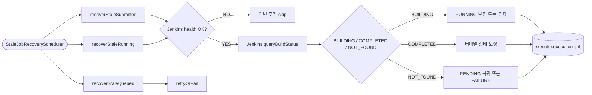

# Stale Job Recovery

## 목적

웹훅 유실, execute 메시지 유실, Jenkins 조회 지연 같은 비정상 상황에서 오래 머무는 Job을 복구한다.

이 유스케이스는 정상 처리 흐름의 보조 장치가 아니라, 분산 환경에서 상태 정합성을 유지하기 위한 필수 방어선이다.

[HTML 시각화 보기](06-stale-job-recovery.html)

## 흐름도

## 진입점

- Scheduler: `StaleJobRecoveryScheduler`
- Application service: `StaleJobRecoveryService`

## 복구 대상

### 1. `SUBMITTED` stale

의미:

- Jenkins trigger는 성공했는데
- 시작 웹훅을 못 받았거나
- 실제로는 큐에서 사라졌는데 executor 상태가 고정된 경우

### 2. `RUNNING` stale

의미:

- 시작 웹훅까지는 받았는데
- 완료 웹훅을 놓쳤거나
- Jenkins에선 이미 종료됐는데 executor 상태가 남아 있는 경우

### 3. `QUEUED` stale

의미:

- 내부 execute command 발행은 됐는데
- 실제 Jenkins trigger 단계로 이어지지 않았거나
- 메시지가 유실된 경우

## 스케줄러 흐름

### `recoverStaleSubmitted()`

1. `submittedStaleSeconds` 기준 이전의 `SUBMITTED` Job 조회
2. Job definition 조회
3. Jenkins health 상태 확인
4. healthy일 때만 Jenkins API로 build status 조회
5. 결과에 따라 다음 분기 수행

- unhealthy
  - 이번 주기에는 복구를 시도하지 않음
  - operator의 다음 health 갱신 주기까지 대기
- `NOT_FOUND`
  - 아직 큐 대기일 수 있으므로 즉시 실패시키지 않음
  - 다만 `submittedStaleSeconds * 3` 이상 지속되면 `retryOrFail`
- `BUILDING`
  - 시작 웹훅이 유실된 것으로 판단
  - `RUNNING` 전환
  - operator started notify 발행
- `COMPLETED`
  - 시작/완료 웹훅이 모두 유실된 것으로 판단
  - 터미널 상태 전환
  - operator completed notify 발행

### `recoverStaleRunning()`

1. `runningStaleMinutes` 기준 이전의 `RUNNING` Job 조회
2. Job definition 조회
3. Jenkins health 상태 확인
4. healthy일 때만 Jenkins API로 build status 조회
5. 결과에 따라 다음 분기 수행

- unhealthy
  - 이번 주기에는 복구를 시도하지 않음
- `BUILDING`
  - 아직 정상 실행 중
  - 아무것도 하지 않음
- `COMPLETED`
  - 완료 웹훅 유실
  - 터미널 상태 전환
  - operator completed notify 발행
- `NOT_FOUND`
  - Jenkins에서 빌드를 찾지 못함
  - `retryOrFail`

### `recoverStaleQueued()`

1. `queuedStaleSeconds` 기준 이전의 `QUEUED` Job 조회
2. Jenkins 확인 없이 바로 `retryOrFail` 수행

이 경로는 "execute 명령이 소비되지 않았거나 Jenkins trigger 전에 막혔다"는 가정 위에서 동작한다.

## 핵심 로직

### 1. Jenkins API가 사실의 최종 출처

정상 경로에서는 Kafka 이벤트가 상태를 이끈다.
하지만 stale recovery에서는 Jenkins API 조회 결과를 더 신뢰한다.

즉, 이벤트 유실 상황에서는 다음처럼 역전된다.

- 평소: Kafka event -> DB 상태 전이
- 복구: Jenkins API 사실 확인 -> DB 상태 전이

단, 지금은 Jenkins 자체가 unhealthy로 표시된 경우 API 사실 확인조차 미룬다.

### 2. health gate 우선

stale recovery도 디스패치와 동일하게 operator가 기록한 health 상태를 먼저 본다.

- 조회 소스: `operator.support_tool.health_status`, `health_checked_at`
- 목적:
  - Jenkins 장애 중 불필요한 반복 호출 방지
  - 토큰 만료나 인증 실패 시 operator의 자동 재발급 완료까지 대기

즉, 복구 스케줄러는 Jenkins가 unhealthy일 때 상태를 섣불리 바꾸지 않는다.

### 3. notify 재발행

stale recovery는 executor 내부 상태만 고치지 않는다.
operator도 놓친 이벤트를 따라잡아야 하므로 notify를 다시 발행한다.

그래서 복구 후에도 아래가 수행된다.

- started notify
- completed notify

### 4. 재시도와 실패의 기준

모든 stale Job을 곧바로 `FAILURE`로 만들지 않는다.

- 일시 장애 가능성이 있으면 `PENDING` 복귀
- 복구 가능성이 없거나 재시도 한도를 넘기면 `FAILURE`

이 덕분에 Jenkins나 메시징 계층의 순간 장애를 흡수할 수 있다.

## 상태 변화 예시

- `SUBMITTED -> RUNNING`
- `SUBMITTED -> SUCCESS/FAILURE/...`
- `SUBMITTED -> PENDING`
- `RUNNING -> SUCCESS/FAILURE/...`
- `RUNNING -> PENDING`
- `QUEUED -> PENDING`
- `QUEUED -> FAILURE`

Jenkins unhealthy 상태에서는 `SUBMITTED`, `RUNNING` Job이 즉시 상태 전이되지 않고 그대로 유지될 수 있다.

## 관련 클래스

- `execution/infrastructure/scheduler/StaleJobRecoveryScheduler`
- `execution/application/StaleJobRecoveryService`
- `execution/infrastructure/jenkins/JenkinsClient`
- `execution/domain/service/DispatchService`
