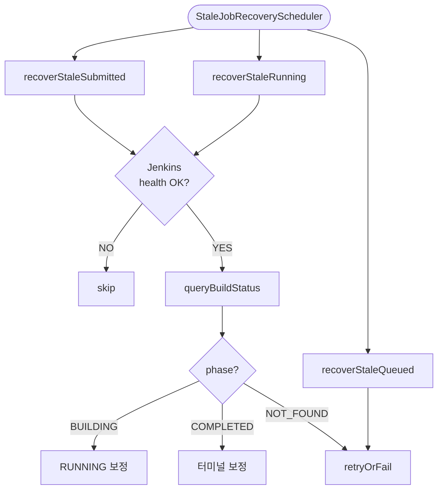

# Stale Job Recovery
---
> webhook 유실, execute 메시지 유실, Jenkins 조회 지연 같은 비정상 상황에서 오래 머무는 Job을 복구한다. 정상 처리 흐름의 보조 장치가 아니라, 분산 환경에서 상태 정합성을 유지하기 위한 필수 방어선이다.

[HTML 시각화 보기](06-stale-job-recovery.html)

## 흐름도



## 진입점

- Scheduler: `StaleJobRecoveryScheduler`
- Application service: `StaleJobRecoveryService`

`StaleJobRecoveryService`는 별도 use case 인터페이스 없이 직접 `@Service`로 선언된다. 스케줄러는 3개 메서드를 서로 다른 주기로 호출한다:

```java
// StaleJobRecoveryScheduler.java
@Scheduled(fixedDelayString = "${executor.submitted-check-interval-ms:10000}")
public void recoverStaleSubmitted() { recoveryService.recoverStaleSubmitted(); }

@Scheduled(fixedDelayString = "${executor.timeout-check-interval-ms:60000}")
public void recoverStaleRunning() { recoveryService.recoverStaleRunning(); }

@Scheduled(fixedDelayString = "${executor.queued-check-interval-ms:15000}")
public void recoverStaleQueued() { recoveryService.recoverStaleQueued(); }
```

SUBMITTED는 10초, QUEUED는 15초, RUNNING은 60초 간격이다. RUNNING이 가장 긴 이유는 빌드 실행 중에는 오래 머무는 것이 정상이기 때문이다.

## 복구 대상

스케줄러가 3가지 상태의 stale Job을 각각 다른 전략으로 복구한다.

### 1. SUBMITTED stale

Jenkins trigger는 성공했으나 시작 webhook을 받지 못한 경우, 또는 실제로는 큐에서 사라졌으나 executor 상태가 갱신되지 않은 경우에 Job이 `SUBMITTED`에 고정된다.

### 2. RUNNING stale

시작 webhook은 받았으나 완료 webhook을 놓친 경우, 또는 Jenkins에서 이미 종료됐으나 executor 상태가 남아 있는 경우에 Job이 `RUNNING`에 고정된다.

### 3. QUEUED stale

내부 execute command 발행은 됐으나 실제 Jenkins trigger 단계로 이어지지 않은 경우, 즉 메시지가 유실된 경우에 Job이 `QUEUED`에 고정된다.

## 처리 흐름

### recoverStaleSubmitted 전체 코드

```java
// StaleJobRecoveryService.java
@Transactional
public void recoverStaleSubmitted() {
    var cutoff = LocalDateTime.now().minusSeconds(properties.getSubmittedStaleSeconds());
    var staleJobs = jobPort.findByStatusAndMdfcnDtBefore(ExecutionJobStatus.SUBMITTED, cutoff);

    for (ExecutionJob job : staleJobs) {
        recoverSubmitted(job);
    }
}

private void recoverSubmitted(ExecutionJob job) {
    var defInfo = jobDefinitionQueryPort.load(job.getJobId());
    if (!jenkinsQueryPort.isHealthy(defInfo.jenkinsInstanceId())) {
        return;
    }

    var buildStatus = jenkinsQueryPort.queryBuildStatus(
            defInfo.jenkinsInstanceId(), defInfo.jenkinsJobPath(), job.getBuildNo());

    switch (buildStatus.phase()) {
        case NOT_FOUND -> {
            var longCutoff = LocalDateTime.now().minusSeconds(
                    (long) properties.getSubmittedStaleSeconds() * 3);
            if (job.getMdfcnDt().isBefore(longCutoff)) {
                dispatchService.retryOrFail(job, properties.getJobMaxRetries());
                jobPort.save(job);
            }
        }
        case BUILDING -> {
            dispatchService.markAsRunning(job, job.getBuildNo());
            jobPort.save(job);
            notifyStartedPort.notify(
                    job.getJobExcnId(), job.getPipelineExcnId()
                    , job.getJobId(), job.getBuildNo());
        }
        case COMPLETED -> {
            dispatchService.markAsCompleted(job, buildStatus.result());
            jobPort.save(job);
            var status = ExecutionJobStatus.fromJenkinsResult(buildStatus.result());
            boolean success = status == ExecutionJobStatus.SUCCESS;
            notifyCompletedPort.notify(
                    job.getJobExcnId(), job.getPipelineExcnId()
                    , success, buildStatus.result()
                    , null, "N"
                    , success ? null : buildStatus.result());
        }
    }
}
```

### recoverStaleRunning 전체 코드

```java
// StaleJobRecoveryService.java
private void recoverRunning(ExecutionJob job) {
    var defInfo = jobDefinitionQueryPort.load(job.getJobId());
    if (!jenkinsQueryPort.isHealthy(defInfo.jenkinsInstanceId())) {
        return;
    }

    var buildStatus = jenkinsQueryPort.queryBuildStatus(
            defInfo.jenkinsInstanceId(), defInfo.jenkinsJobPath(), job.getBuildNo());

    switch (buildStatus.phase()) {
        case BUILDING -> { /* 정상 실행 중 — 아무것도 하지 않음 */ }
        case COMPLETED -> {
            dispatchService.markAsCompleted(job, buildStatus.result());
            jobPort.save(job);
            var status = ExecutionJobStatus.fromJenkinsResult(buildStatus.result());
            boolean success = status == ExecutionJobStatus.SUCCESS;
            notifyCompletedPort.notify(
                    job.getJobExcnId(), job.getPipelineExcnId()
                    , success, buildStatus.result()
                    , null, "N"
                    , success ? null : buildStatus.result());
        }
        case NOT_FOUND -> {
            dispatchService.retryOrFail(job, properties.getJobMaxRetries());
            jobPort.save(job);
        }
    }
}
```

### recoverStaleQueued 전체 코드

```java
// StaleJobRecoveryService.java
@Transactional
public void recoverStaleQueued() {
    var cutoff = LocalDateTime.now().minusSeconds(properties.getQueuedStaleSeconds());
    var staleJobs = jobPort.findByStatusAndMdfcnDtBefore(ExecutionJobStatus.QUEUED, cutoff);

    for (ExecutionJob job : staleJobs) {
        dispatchService.retryOrFail(job, properties.getJobMaxRetries());
        jobPort.save(job);
    }
}
```

### 코드 설명

**SUBMITTED 복구 — 3분기**: Jenkins API로 빌드 상태를 조회한 뒤 phase에 따라 분기한다. `NOT_FOUND`일 때 즉시 실패시키지 않는 이유는 Jenkins 큐 대기 시간이 길 수 있기 때문이다. `submittedStaleSeconds * 3`까지 추가로 기다린 뒤에도 NOT_FOUND이면 `retryOrFail`을 수행한다. `BUILDING`이면 시작 webhook 유실로 판단해 RUNNING 전이 + started notify를 재발행한다. `COMPLETED`이면 양쪽 webhook 모두 유실로 판단해 터미널 전이 + completed notify를 재발행한다.

**RUNNING 복구 — 3분기**: `BUILDING`이면 정상 실행 중이므로 아무것도 하지 않는다. `COMPLETED`이면 완료 webhook 유실로 판단해 터미널 전이 + completed notify를 복구한다. `NOT_FOUND`이면 실행 경로가 끊긴 것으로 보고 `retryOrFail`을 수행한다.

**QUEUED 복구**: Jenkins 확인 없이 바로 `retryOrFail`을 수행한다. execute 명령이 소비되지 않았거나 trigger 전에 막혔다는 가정이므로 Jenkins에 빌드가 존재하지 않을 가능성이 높다.

## 핵심 로직

### 1. Jenkins API가 사실의 최종 출처

정상 경로에서는 Kafka 이벤트가 상태를 이끈다. 하지만 stale recovery에서는 Jenkins API 조회 결과를 더 신뢰한다. 단, Jenkins 자체가 unhealthy로 표시된 경우 API 사실 확인조차 미룬다.

- 평소: Kafka event → DB 상태 전이
- 복구: Jenkins API 사실 확인 → DB 상태 전이

### 2. health gate 우선

stale recovery도 디스패치와 동일하게 operator가 기록한 health 상태를 먼저 본다. 목적은 Jenkins 장애 중 불필요한 반복 호출 방지와, 토큰 만료나 인증 실패 시 operator의 자동 재발급 완료까지 대기하는 것이다. 복구 스케줄러는 Jenkins가 unhealthy일 때 상태를 섣불리 바꾸지 않는다.

### 3. notify 재발행

stale recovery는 executor 내부 상태만 고치지 않는다. operator도 놓친 이벤트를 따라잡아야 하므로 started notify와 completed notify를 다시 발행한다.

### 4. 재시도와 실패의 기준

모든 stale Job을 곧바로 `FAILURE`로 만들지 않는다. 일시 장애 가능성이 있으면 `PENDING` 복귀, 복구 가능성이 없거나 재시도 한도를 넘기면 `FAILURE`다. 이 덕분에 Jenkins나 메시징 계층의 순간 장애를 흡수할 수 있다.

## 상태 변화 요약

| 입력 상태 | Jenkins phase | 결과 |
|-----------|---------------|------|
| SUBMITTED | BUILDING | → RUNNING + started notify |
| SUBMITTED | COMPLETED | → 터미널 + completed notify |
| SUBMITTED | NOT_FOUND (단기) | 유지 (다음 주기 재확인) |
| SUBMITTED | NOT_FOUND (장기) | → retryOrFail |
| RUNNING | BUILDING | 유지 (정상 실행 중) |
| RUNNING | COMPLETED | → 터미널 + completed notify |
| RUNNING | NOT_FOUND | → retryOrFail |
| QUEUED | - | → retryOrFail (Jenkins 미확인) |

Jenkins unhealthy 상태에서는 SUBMITTED, RUNNING Job이 즉시 상태 전이되지 않고 그대로 유지된다.

## 관련 클래스

- `execution/infrastructure/scheduler/StaleJobRecoveryScheduler`
- `execution/application/StaleJobRecoveryService`
- `execution/infrastructure/jenkins/JenkinsClient`
- `execution/domain/service/DispatchService`
- `execution/domain/port/out/NotifyJobStartedPort`
- `execution/domain/port/out/NotifyJobCompletedPort`
