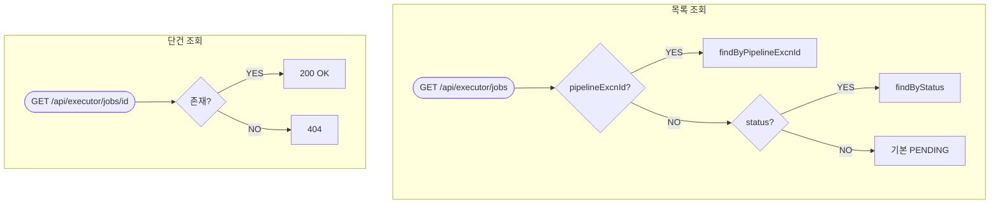

# Query Jobs
---
> executor가 관리하는 `execution_job`을 REST API로 조회한다. 상태별 필터링과 파이프라인 단위 조회를 제공하며, 운영자가 현재 실행 현황을 파악하는 데 사용한다.

## 흐름도



## 진입점

- REST Controller: `DispatchController`
- 직접 `ExecutionJobPort`를 주입받아 조회한다 (별도 use case 인터페이스 없음).

## API 목록

### GET /api/executor/jobs

상태별 또는 파이프라인 단위로 Job 목록을 조회한다.

```java
// DispatchController.java
@GetMapping("/jobs")
public ResponseEntity<List<ExecutionJob>> listJobs(
        @RequestParam(required = false) String status
        , @RequestParam(required = false) String pipelineExcnId
) {
    if (pipelineExcnId != null) {
        return ResponseEntity.ok(jobPort.findByPipelineExcnId(pipelineExcnId));
    }
    if (status != null) {
        return ResponseEntity.ok(
                jobPort.findByStatus(ExecutionJobStatus.valueOf(status)));
    }
    return ResponseEntity.ok(jobPort.findByStatus(ExecutionJobStatus.PENDING));
}
```

쿼리 파라미터 우선순위는 `pipelineExcnId > status > 기본(PENDING)`이다. 둘 다 없으면 PENDING 상태 Job만 반환한다.

### GET /api/executor/jobs/{jobExcnId}

단건 Job을 조회한다. 없으면 404를 반환한다.

```java
// DispatchController.java
@GetMapping("/jobs/{jobExcnId}")
public ResponseEntity<ExecutionJob> getJob(@PathVariable String jobExcnId) {
    return jobPort.findById(jobExcnId)
            .map(ResponseEntity::ok)
            .orElse(ResponseEntity.notFound().build());
}
```

## 관련 클래스

- `execution/api/DispatchController`
- `execution/domain/port/out/ExecutionJobPort`
