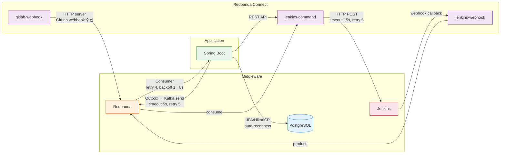
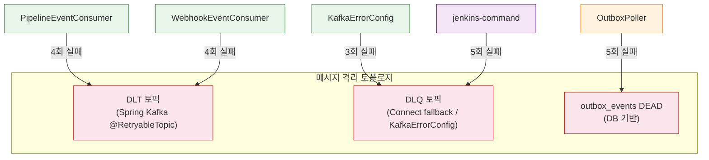
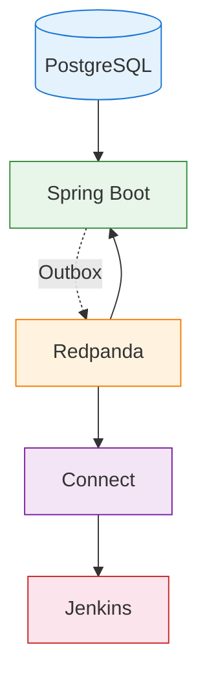

# 장애 시나리오 — 시스템 동작과 내결함성

이 문서는 Redpanda Playground의 각 통신 경로에서 장애가 발생했을 때 **시스템이 어떻게 동작하는지** — 재시도 메커니즘, 로그 출력, 상태 전이, 메시지 격리 — 를 다룬다. 서버 재시작 같은 복구 절차가 아니라, 장애 발생 순간부터 시스템이 스스로 처리하는 과정을 중심으로 기술한다. 모니터링 컴포넌트 트러블슈팅은 [07-troubleshooting.md](./07-troubleshooting.md), 알림 설정은 [05-dashboards-and-alerts.md](./05-dashboards-and-alerts.md)를 참조한다.

---

## 1. 통신 경로와 내결함성 요약



### 재시도/격리 정책 전체 맵

| 컴포넌트 | 소스 | 타임아웃 | 재시도 | 백오프 | 최종 실패 시 |
|----------|------|---------|--------|--------|-------------|
| OutboxPoller | `outbox/OutboxPoller.java` | 5s (Kafka send) | 5회 | retry_count 증가 | **DEAD 마킹** (DB) |
| PipelineEventConsumer | `event/PipelineEventConsumer.java` | — | 4회 (@RetryableTopic) | 1s→2s→4s→8s | **DLT 토픽** 이동 |
| KafkaErrorConfig | `common-kafka/.../KafkaErrorConfig.java` | — | 3회 (7s) | 1s→2s→4s | **DLQ 토픽** 이동 |
| WebhookEventConsumer | `webhook/WebhookEventConsumer.java` | — | 4회 | 1s→2s→4s→8s | **DLT**, null fallback |
| JenkinsAdapter | `adapter/JenkinsAdapter.java` | ~30s (default) | 0회 | — | **null 반환** |
| ConnectStreamsClient | `client/ConnectStreamsClient.java` | default | 0회 | — | **false 반환** |
| ConnectorRestoreListener | `service/ConnectorRestoreListener.java` | — | 5회 | 2s→4s→8s→16s→32s | **ERROR 로그** 후 포기 |
| WebhookTimeoutChecker | `engine/WebhookTimeoutChecker.java` | 5분 | — | 30s 폴링 | **FAILED** + SAGA 보상 |
| jenkins-command.yaml | `connect/jenkins-command.yaml` | 15s (HTTP) | 5회 | 2s→30s | **DLQ** (playground.dlq) |
| jenkins-webhook.yaml | `connect/jenkins-webhook.yaml` | 5s (input) | 5회 | 500ms→10s | — |

**비재시도 예외** (KafkaErrorConfig): `IllegalArgumentException`, `AvroSerializationException` — poison pill은 재시도 없이 DLT 직행.

---

## 2. Producer 경로: Outbox → Redpanda

### 2-1. Redpanda 다운 시 OutboxPoller 동작

OutboxPoller는 500ms 간격으로 outbox_events 테이블을 폴링하여 PENDING 이벤트를 Kafka로 발행한다. Redpanda가 다운되면 `KafkaTemplate.send()`가 5초 타임아웃 후 예외를 던진다.

**재시도 흐름:**

```
폴링 → PENDING 이벤트 조회 → KafkaTemplate.send() 호출
  ↓ (Redpanda 다운)
TimeoutException 발생 (5s 후)
  ↓
catch 블록: retry_count++ → DB UPDATE
  ↓
다음 폴링 주기에 같은 이벤트 재조회 (retry_count < MAX_RETRIES)
  ↓
5회 실패 시: status = 'DEAD' 마킹 → 더 이상 폴링하지 않음
```

**로그 출력:**

```
WARN  OutboxPoller — Kafka send failed for event={id}, retry={count}/5: TimeoutException
ERROR OutboxPoller — Event {id} marked as DEAD after 5 retries
```

**DB 상태 전이:**

| retry_count | status | 의미 |
|-------------|--------|------|
| 0 | PENDING | 최초 생성, 발행 대기 |
| 1~4 | PENDING | 발행 실패, 다음 폴링에 재시도 |
| 5 | DEAD | 최대 재시도 초과, 수동 개입 필요 |

핵심은 OutboxPoller가 **DB 기반 재시도**를 한다는 점이다. 메모리가 아닌 DB에 retry_count를 저장하므로, Spring Boot가 중간에 재시작되어도 재시도 상태가 유지된다.

### 2-2. PostgreSQL 다운 시 Outbox INSERT 실패

HTTP 요청 → 서비스 로직 → outbox INSERT 경로에서 DB가 다운되면 INSERT 자체가 실패한다.

**동작:**

```
POST /api/tickets → TicketService.create() → outbox INSERT
  ↓ (PostgreSQL 다운)
HikariCP: Connection is not available (30s timeout)
  ↓
500 Internal Server Error 반환
  ↓
이벤트가 outbox에 들어가지 않았으므로 Kafka 발행도 없음
```

**로그 출력:**

```
ERROR HikariPool-1 — Connection is not available, request timed out after 30000ms
WARN  TicketService — Failed to create ticket: could not acquire connection
```

HikariCP는 DB 복구 후 자동으로 커넥션을 재확보한다. Spring Boot 재시작이 필요 없는 이유는 HikariCP가 `connectionTestQuery`로 주기적으로 커넥션 유효성을 검증하고, 무효한 커넥션을 풀에서 제거한 뒤 새 커넥션을 생성하기 때문이다.

---

## 3. Consumer 경로: Redpanda → Spring Boot

### 3-1. Consumer 처리 중 예외 발생

메시지를 정상 수신했지만 처리 로직에서 예외가 발생하는 경우다. 두 가지 재시도 메커니즘이 레이어별로 동작한다.

**레이어 1: @RetryableTopic (PipelineEventConsumer)**

Spring Kafka의 `@RetryableTopic`이 실패한 메시지를 재시도 토픽으로 이동시킨다. 원본 토픽의 다른 메시지 처리를 블로킹하지 않는다.

```
pipeline.events.completed (원본)
  → 처리 실패
  → pipeline.events.completed-retry-0 (1s 후)
  → 처리 실패
  → pipeline.events.completed-retry-1 (2s 후)
  → 처리 실패
  → pipeline.events.completed-retry-2 (4s 후)
  → 처리 실패
  → pipeline.events.completed-retry-3 (8s 후)
  → 처리 실패
  → pipeline.events.completed-dlt (Dead Letter Topic, 최종 격리)
```

**로그 출력:**

```
WARN  RetryTopicInternalBeanNames — Sending message to retry topic pipeline.events.completed-retry-0
ERROR PipelineEventConsumer — Processing failed for correlationId={id}: {exception}
ERROR RetryTopicInternalBeanNames — Sending message to DLT pipeline.events.completed-dlt
```

**레이어 2: KafkaErrorConfig (공통 에러 처리)**

`@RetryableTopic`이 없는 Consumer에 적용되는 공통 정책이다. `DefaultErrorHandler`에 `FixedBackOff(1000, 3)`으로 설정되어 같은 파티션에서 3회 재시도 후 DLQ(Topics.DLQ)로 전송한다.

```
Consumer 예외 → 1s 대기 → 재시도 1 → 2s 대기 → 재시도 2 → 4s 대기 → 재시도 3 → DLQ
```

### 3-2. Avro 역직렬화 실패 (Poison Pill)

스키마 불일치나 손상된 바이트 배열은 재시도해도 해결되지 않는다. KafkaErrorConfig에서 `AvroSerializationException`과 `IllegalArgumentException`을 비재시도 예외로 등록하여 **재시도 없이 즉시 DLT로 격리**한다.

**동작:**

```
메시지 수신 → Avro 역직렬화 시도
  ↓ (스키마 불일치)
AvroSerializationException 발생
  ↓
KafkaErrorConfig: 비재시도 예외 → 재시도 skip
  ↓
즉시 DLT 토픽으로 이동 (재시도 0회)
```

**로그 출력:**

```
ERROR KafkaErrorConfig — Non-retryable exception, sending to DLT: AvroSerializationException
```

재시도를 skip하는 이유: poison pill 메시지를 3회 재시도하면 7초 동안 해당 파티션의 다른 정상 메시지도 처리가 지연된다. 비재시도 예외 등록으로 이 블로킹을 방지한다.

### 3-3. Redpanda 브로커 다운 시 Consumer 동작

브로커가 다운되면 Consumer의 `poll()` 호출이 실패한다. Spring Kafka의 `ConcurrentMessageListenerContainer`가 내부적으로 재연결을 시도하며, 브로커 복구 시 자동으로 마지막 커밋된 오프셋부터 재소비한다.

**로그 출력:**

```
WARN  ConsumerCoordinator — [Consumer clientId=xxx] Connection to node -1 failed
ERROR KafkaMessageListenerContainer — Consumer exception: DisconnectException
INFO  ConsumerCoordinator — [Consumer clientId=xxx] Discovered group coordinator redpanda:9092
```

Consumer 오프셋은 Redpanda에 커밋되어 있으므로, 브로커 복구 후 메시지 유실 없이 이어서 처리한다. 다만 브로커 다운 중에 Producer가 발행한 메시지는 OutboxPoller의 DB 기반 재시도로 보호된다.

---

## 4. Connect 경로: Redpanda → Connect → Jenkins

### 4-1. Jenkins HTTP 응답 실패

jenkins-command 파이프라인이 Jenkins API에 HTTP POST를 보내면 15초 타임아웃이 적용된다. 실패 시 Connect 자체의 재시도 메커니즘이 동작한다.

**재시도 흐름:**

```
Kafka consume → HTTP POST to Jenkins
  ↓ (Jenkins 다운 또는 타임아웃)
시도 1: 실패 → 2s 대기
시도 2: 실패 → 4s 대기
시도 3: 실패 → 8s 대기
시도 4: 실패 → 16s 대기
시도 5: 실패 → 30s 대기 (max_backoff)
  ↓
모두 실패 → DLQ 토픽(playground.dlq)으로 메시지 이동
```

**Connect 로그 출력:**

```
WARN  @connect — HTTP request failed (attempt 1/5): context deadline exceeded
WARN  @connect — HTTP request failed (attempt 5/5): connection refused
ERROR @connect — max retries exceeded, sending to DLQ: playground.dlq
```

**jenkins-command.yaml의 재시도 설정:**

```yaml
output:
  fallback:
    - kafka:  # 정상 처리
    - kafka:  # DLQ fallback
        topic: playground.dlq
  retry:
    max_retries: 5
    backoff:
      initial_interval: 2s
      max_interval: 30s
```

### 4-2. Jenkins 웹훅 콜백 미수신

Jenkins가 빌드를 완료하고 Connect의 jenkins-webhook 엔드포인트(:4195/jenkins-webhook/webhook/jenkins)로 콜백을 보내는데, Connect가 다운이거나 네트워크 문제로 콜백이 도달하지 못하면 Spring Boot 측의 WebhookTimeoutChecker가 동작한다.

**타임아웃 감지 흐름:**

```
PipelineEngine: 파이프라인 스텝을 WAITING_WEBHOOK 상태로 설정
  ↓
WebhookTimeoutChecker: 30초 간격으로 폴링
  → "WAITING_WEBHOOK 상태이고 5분 이상 경과한 파이프라인이 있는가?"
  ↓ (5분 초과)
파이프라인 상태를 FAILED로 변경
  ↓
SagaCompensator: 보상 트랜잭션 실행 (이전 스텝 롤백)
```

**로그 출력:**

```
WARN  WebhookTimeoutChecker — Pipeline execution {id} timed out (>5min in WAITING_WEBHOOK)
INFO  WebhookTimeoutChecker — Marking execution {id} as FAILED
INFO  SagaCompensator — Compensating step {stepType} for execution {id}
```

### 4-3. CAS 경쟁: 웹훅 도착 vs 타임아웃

웹훅이 정확히 5분 전후에 도착하면 `resumeAfterWebhook`과 `WebhookTimeoutChecker`가 동시에 같은 파이프라인 상태를 변경하려 할 수 있다. JPA의 `@Version` 기반 낙관적 잠금으로 하나만 성공한다.

```
                        시간 ──────────────────────────→
                                            5분 경과
resumeAfterWebhook:    ─────────────────── CAS 시도 ──→ (성공 또는 실패)
WebhookTimeoutChecker: ─────────────────── CAS 시도 ──→ (성공 또는 실패)
```

- **타임아웃이 먼저 CAS 성공**: 파이프라인 FAILED → 웹훅 도착 시 CAS 실패 → skip (이미 FAILED)
- **웹훅이 먼저 CAS 성공**: 파이프라인 다음 스텝 진행 → 타임아웃 CAS 실패 → skip (이미 진행 중)

**로그 출력 (CAS 실패 시):**

```
WARN  PipelineEngine — CAS failed for execution {id}, already updated by another thread
```

---

## 5. 어댑터 경로: Spring Boot → 외부 도구

### 5-1. JenkinsAdapter — 재시도 없이 null 반환

JenkinsAdapter는 Jenkins REST API 호출이 실패하면 **재시도 없이 null을 반환**한다. 호출자가 null 체크로 후속 처리를 결정한다. RestTemplate의 기본 타임아웃(~30s) 후 예외가 발생하면 catch에서 처리한다.

```
JenkinsAdapter.getBuildInfo("job", 1)
  → RestTemplate.exchange() → 30s 타임아웃 또는 ConnectionRefused
  → catch (Exception e) → log.warn() → return null
```

**로그 출력:**

```
WARN  JenkinsAdapter — Jenkins getBuildInfo failed: job=test, build=1: Connection refused
```

### 5-2. ConnectStreamsClient — 재시도 없이 false 반환

Connect REST API 호출이 실패하면 **false를 반환**한다. 단, `ConnectorRestoreListener`는 앱 시작 시 Connect 상태를 복원하기 위해 **자체 지수 백오프 재시도**를 수행한다.

```
ConnectorRestoreListener.onApplicationEvent()
  → ConnectStreamsClient.isActive() → false
  → 2s 대기 → 재시도 1
  → 4s 대기 → 재시도 2
  → 8s 대기 → 재시도 3
  → 16s 대기 → 재시도 4
  → 32s 대기 → 재시도 5
  → 모두 실패 → ERROR 로그 후 포기 (앱은 정상 기동, Connect 연동만 비활성)
```

**로그 출력:**

```
WARN  ConnectorRestoreListener — Connect not available, retrying (1/5)...
WARN  ConnectorRestoreListener — Connect not available, retrying (5/5)...
ERROR ConnectorRestoreListener — Failed to restore connector state after 5 retries. Connect integration disabled.
```

### 5-3. GitLabAdapter / NexusAdapter / RegistryAdapter — 빈 리스트 반환

3개 어댑터는 모두 같은 패턴을 따른다. 외부 API 호출이 실패하면 **빈 리스트(또는 null)를 반환**하여 UI에서 빈 목록이 표시된다. 재시도 없이 다음 요청 시 다시 시도한다.

```
GitLabAdapter.getProjects()
  → RestTemplate.exchange() → GitLab 다운
  → catch (Exception e) → log.warn() → return Collections.emptyList()
```

**로그 출력:**

```
WARN  GitLabAdapter — GitLab getProjects failed — check container status and PAT credential. url=http://..., error=Connection refused
```

---

## 6. 메시지 격리 토폴로지

장애로 처리할 수 없는 메시지는 원본 토픽에서 격리되어 정상 메시지 처리를 블로킹하지 않는다. 격리 위치는 3곳이다.

### 6-1. DLT (Dead Letter Topic) — Spring Kafka

`@RetryableTopic`이 재시도를 모두 소진한 메시지가 이동하는 토픽이다. 토픽명은 `{원본토픽}-dlt` 패턴이다.

```
pipeline.events.completed-dlt        ← PipelineEventConsumer 실패
pipeline.webhook.events-dlt          ← WebhookEventConsumer 실패
```

DLT 메시지에는 원본 토픽, 파티션, 오프셋, 예외 정보가 헤더에 포함된다. 원인 해결 후 DLT에서 원본 토픽으로 재발행하면 재처리된다.

### 6-2. DLQ (Dead Letter Queue) — Connect / KafkaErrorConfig

Connect의 fallback output과 KafkaErrorConfig의 `DeadLetterPublishingRecoverer`가 사용하는 토픽이다.

```
playground.dlq                       ← jenkins-command 파이프라인 5회 재시도 실패
Topics.DLQ                           ← KafkaErrorConfig 3회 재시도 실패
```

### 6-3. DEAD 마킹 — Outbox 테이블

Kafka 발행 자체가 실패한 이벤트는 DB에 `status = 'DEAD'`로 마킹된다. Kafka 토픽이 아닌 DB에 격리되는 유일한 경우다.

```sql
SELECT id, aggregate_type, event_type, retry_count, status
FROM outbox_events WHERE status = 'DEAD';
```

### 격리 위치 요약



---

## 7. 로그 기반 장애 감지

Grafana Loki에서 아래 LogQL 쿼리로 장애 상황을 실시간 감지할 수 있다.

```logql
# Outbox 발행 실패 (DEAD 마킹)
{service_name="redpanda-playground"} |= "marked as DEAD"

# Kafka Consumer 재시도 발생
{service_name="redpanda-playground"} |= "retry topic" |= "sending"

# DLT/DLQ 이동
{service_name="redpanda-playground"} |= "DLT" OR |= "DLQ"

# Jenkins 연결 실패
{container="playground-connect"} |= "deadline exceeded" OR |= "connection refused"

# HikariCP 커넥션 고갈
{service_name="redpanda-playground"} |= "Connection is not available"

# WebhookTimeoutChecker 타임아웃 감지
{service_name="redpanda-playground"} |= "timed out" |= "WAITING_WEBHOOK"
```

---

## 8. 의존 관계와 장애 전파

하나의 컴포넌트 장애가 다른 컴포넌트에 어떻게 전파되는지 정리한다.



| 장애 원인 | 직접 영향 | 간접 영향 | 자동 복구 |
|----------|----------|----------|----------|
| **Redpanda 다운** | Producer 발행 실패 (DEAD 마킹), Consumer poll 실패, Connect 중단 | 파이프라인 전체 정체 | 브로커 복구 시 Consumer 자동 재연결, OutboxPoller 재발행 |
| **PostgreSQL 다운** | 모든 API 500 에러, Outbox INSERT 불가 | 이벤트 생성 자체가 불가 → Kafka 발행 없음 | HikariCP 자동 재연결 |
| **Jenkins 다운** | Connect HTTP 5회 재시도 → DLQ | 파이프라인 WAITING_WEBHOOK → 5분 후 FAILED | Connect 새 메시지는 Jenkins 복구 시 정상 처리 |
| **Connect 다운** | Jenkins 커맨드 중단, 웹훅 수신 불가 | 파이프라인 WAITING_WEBHOOK → 5분 후 FAILED | Connect 복구 시 Kafka 오프셋부터 재소비 |
| **Spring Boot 다운** | API 불가, Consumer 중단 | Outbox 폴링 중단 (PENDING 누적), Connect는 독립 동작 | 재시작 시 미처리 Outbox 재발행, Consumer 오프셋부터 재소비 |
